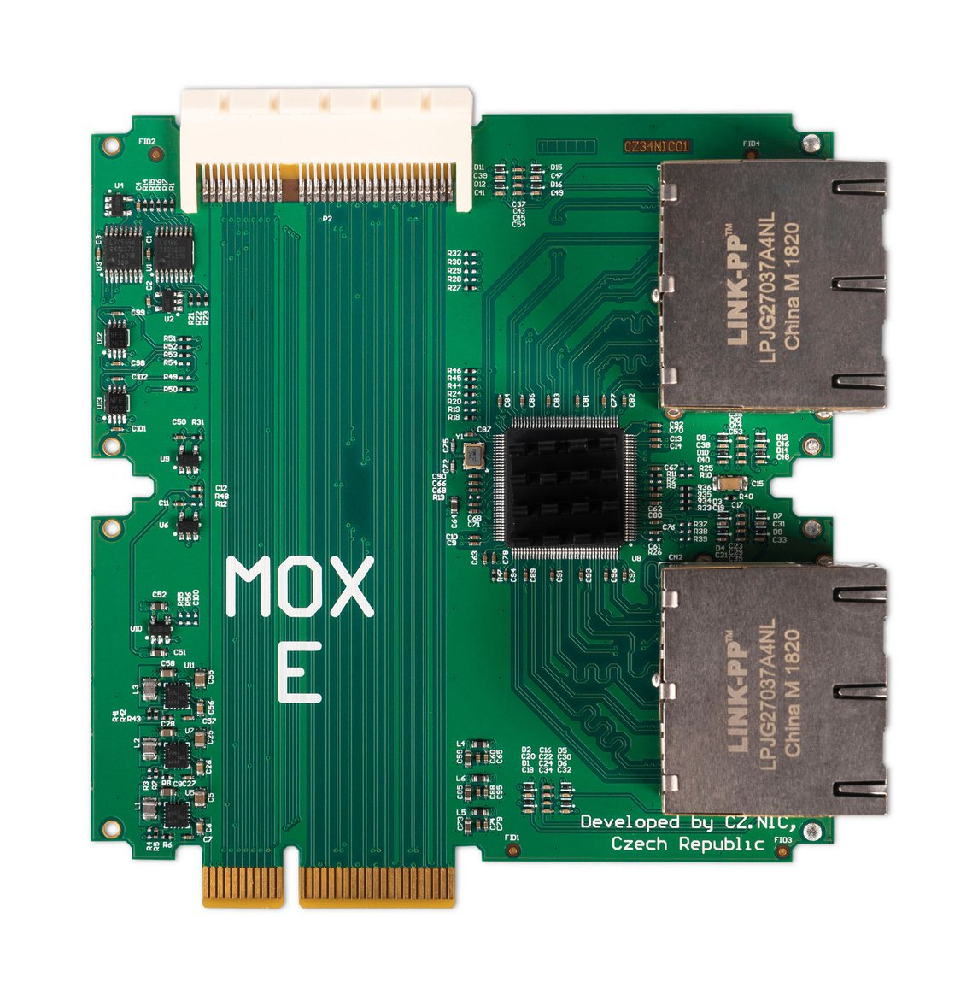

# MOX E (Super Ethernet)

## Key features

The MOX E module is an ideal choice if you need more Ethernet ports to connect
devices to your network. It has twice the width of the other modules and
contains an eight-port manageable switch for gigabit Ethernet.

## Specification

* 1× 64 pin female connector and 1× 64 pin male connector for connection additional modules
* 8× 10/100/1000 Mbps (RJ-45)
* 2 years warranty
* Size: 105 mm × 110 mm × 30 mm (without case)
* Ambient operating temperature: 0 °C to 40 °C (40 °F to 104 °F)
* Humidity: 10% to 90% RH, Non-condensing

## Compatibility

Unlike in the MOX C module, the SGMII bus is not terminated in the MOX E module
and it is possible to connect up to three MOX E modules in a row.

This module can be used **only as an extension in a set**. You will need at
least [MOX Start](../sets/start.md). If you’re combining it with other
modules, make sure they are compatible. You can verify the order of modules and
pass-through of PCIe and SGMII signals in the configurator on
<https://mox-configurator.turris.cz>.
