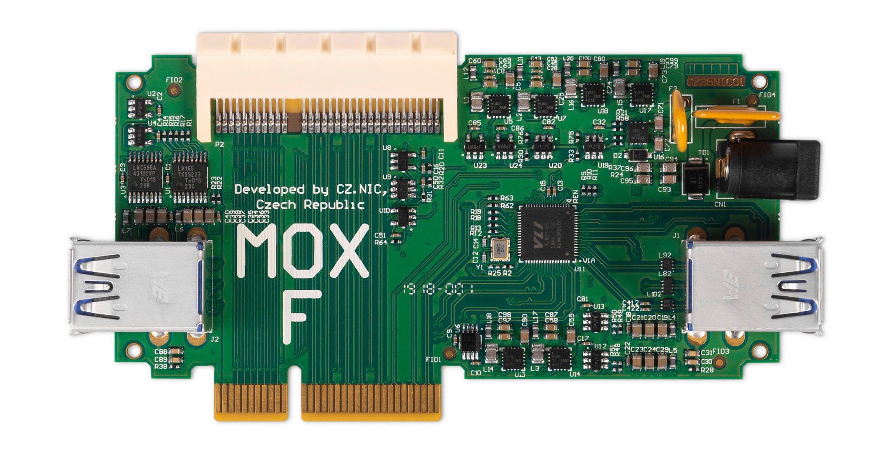

# MOX F (USB)

## Key features

The MOX F module expands your configuration with more USB 3.0 ports with transfer
speeds of up to 5 Gbps that you can use to connect external drives, TV tuners
and other devices.

If using MOX F use this module to power the whole set. It‘s possible to power the whole set from MOX F without using the power supply from MOX A. It is also possible to use both power supplies from MOX A and F at the same time.

Recommended average load of USB ports on MOX F while using all ports and
using power supply on MOX F is 800mA maximum per port. This limit should be
more than enough for ordinary usage. If you need a little bit more we recommend
using additional cooling. Using only power supply on MOX A significantly deacreases load limit of USB ports. It can drop up to unusable level. The real limit depends on other
connected modules.

## Specification

* 4x USB 3.0 ports
* DC input 12 V ± 5 % / 5 A
* 1× 64 pin female connector and 1× 64 pin male connector for connection additional modules
* 2 years warranty
* Size: 110 mm × 58 mm × 19 mm (without case)
* Ambient operating temperature: 0 °C to 40 °C (40 °F to 104 °F)
* Humidity: 10% to 90% RH, Non-condensing

## Compatibility

There can be only one MOX F module in the configuration; the PCIe bus is
terminated there. For this reason, MOX F cannot be combined with MOX B.

This module can be used **only as an extension in a set**. You will need at
least [MOX Start](../sets/start.md). If you’re combining it with other
modules, make sure they are compatible. You can verify the order of modules and
pass-through of PCIe and SGMII signals in the configurator on
<https://mox-configurator.turris.cz>.

