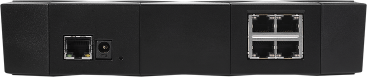

# MOX Classic

The most demanded configuration of Turris MOX router. Marvell Armada 3720 1 GHz
dual core, 512 MB DDR3, GWAN/GLAN, USB 3.0, microSD slot, 2×2 MIMO a 3×3 MIMO
2.4/5 GHz Wi-Fi, Bluetooth, 4× GLAN

## About

{! hw/mox/sets/generic_mox.md !}

Choose the MOX Classic if you want both wireless connectivity and the option to
connect several devices by Ethernet cable.

This set consists of the [MOX A (Basic)](../modules/a.md) module, a power
source, a microSD card, the [MOX B (Extension) module](../modules/b.md), [MOX C
(Ethernet) module](../modules/c.md), [MOX Wi-Fi add-on
(SDIO)](../addons.md#wi-fi-sdio) and [MOX Wi-Fi add-on
(mPCIe)](../addons.md#wi-fi-mpcie).

The MOX Classic configuration can be expanded with accessories. But there are
many reasons to fall in love:

{! hw/mox/sets/feature_list.md !}
