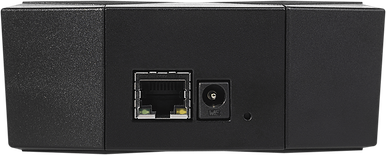

# MOX Start

A basic configuration of the Turris MOX router. Marvell Armada 3720 1 GHz dual
core, 1 GB DDR3 RAM, GWAN/GLAN, 1× USB 3.0 (5 V, 1.5 A on output), 1× microSD
slot

## About

{! hw/mox/sets/generic-mox.md !}

This set consists of [MOX A (Basic)](../modules/a.md), a power source and a
microSD card, representing the basic building block of the modular solution
Turris MOX. It can also be used as a small server. If you add the MOX Wi-Fi
add-on (SDIO), the result is a Wi-Fi router with Bluetooth support.

The MOX Start set is just the beginning. But there are many reasons to fall in
love:





