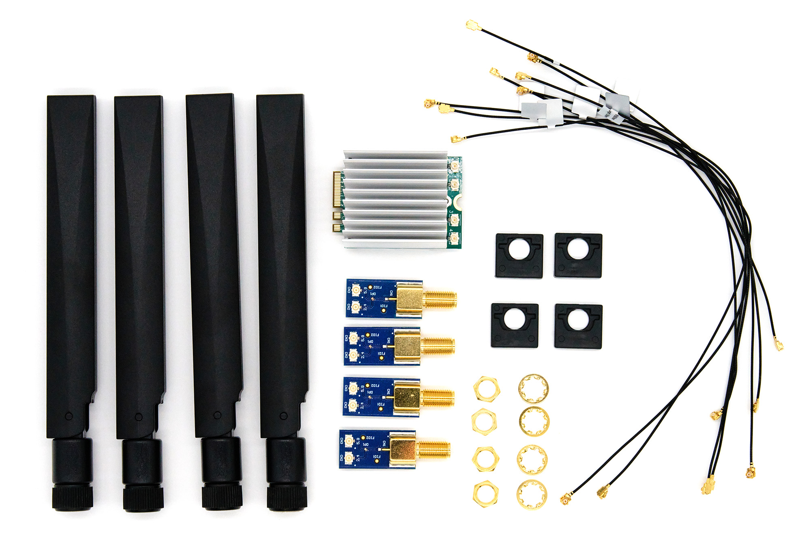
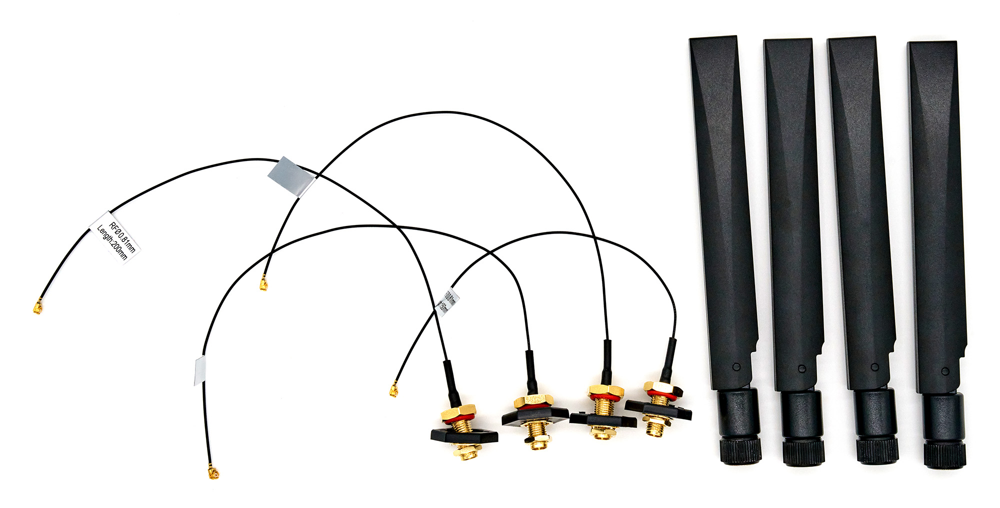
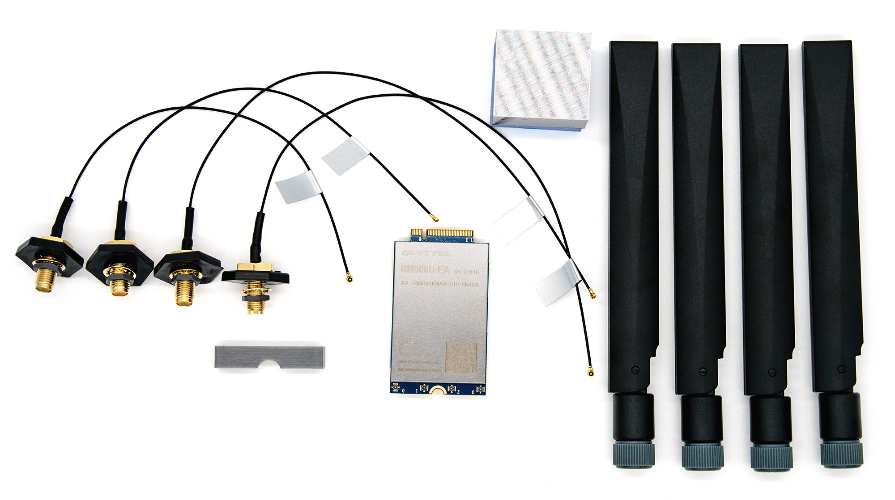

# Add-ons

Add-ons are specific accessories that can extend the functionality of Turris Omnia NG
or Turris Omnia NG Wired.

## Wi-Fi 7 Upgrade Kit

Wi-Fi 7 kit will allow you to turn your Turris Omnia NG Wired into a full Turris
Omnia NG. Insert the Wi-Fi card into an M.2 slot, make sure to **insert a thermal
pad below the card and on top of the heatsink**. Also, make sure that you
**remove the blue cover** from the pad before application. Mount diplexers into
the case and connect them with cables to the card and to the onboard Wi-Fi. Make
sure that cables from the **onboard card go to the 2.4 connectors on diplexers**,
and the cables from the Wi-Fi 7 card go to the other port. See the Omnia NG
assembled [board picture](omnia-ng.md#m2-slots) in our documentation for
guidance.

The kit contains Wi-Fi 7 card Noni56M2-2x2-B, four diplexers, four plastic diplexer
holders, three MHF1-MHF1 15cm cables, five MHF1-MHF1 20cm cables, two thermal
pads, and four YEBT002W1AM antennas.

## Wi-Fi 6 Upgrade Kit

Every Turris Omnia NG Wired has onboard 2.4GHz Wi-Fi 6. To make use of it, we
are offering a set of pigtails and antennas so you can get some basic Wi-Fi
connectivity. Screw on the pigtails to the holes that are in the case already,
connect the pigtails to the connectors on board and you are good to go.

The kit contains three MHF1-RP-SMA 20cm pigtails, one MHF1-RP-SMA 15cm pigtail,
four plastic pigtail holders, and four YEBT002W1AM antennas.

## 5G Kit

The 5G Kit contains everything you need (except a SIM card) to get 5G connectivity on
your router. Insert the 5G card into an M.2 slot, make sure to **insert a thermal
pad below the card, glue the heatsink on top of the card, and another thermal
pad on top of the heatsink**. Also, make sure that you **remove the blue cover**
from the pad before application. Mount the pigtails into the case and connect them
with cables to the card, and **secure the cables** on the card with the attached plastic
clip. Insert SIM card that doesn't require PIN into SIM0 slot and install
support for %G kit from package lists in reForis.

The kit contains a 5G card Quectel RM500UEA, four 5G antennas, two 15cm MHF4-SMA
pigtails, two 20cm MHF4-SMA pigtails, four plastic pigtail holders, a plastic
clip to secure MHF-4 connectors, a aluminium heatsink, and two thermal pads.
