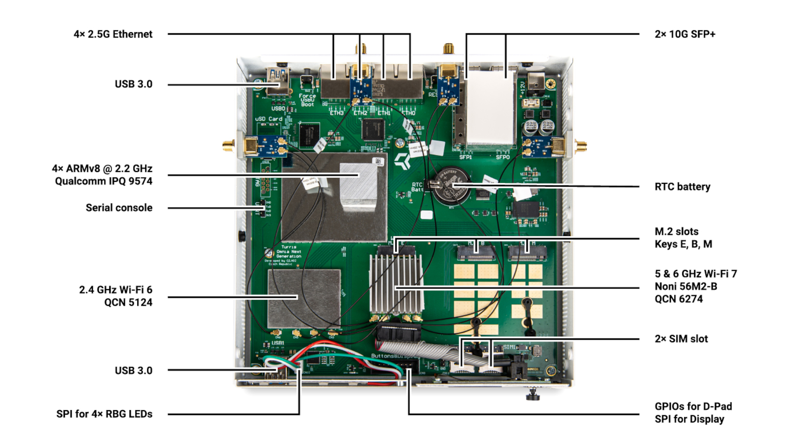

# Turris Omnia NG

Turris Omnia NG is our new powerful SOHO router. It is based on **Qualcomm IPQ
9574 CPU** - quad-core ARMv8 (Cortex A-73) running at **2.2 GHz**. It has **two
gigs of RAM**. It uses an **8 GB eMMC** as its main storage.

## M.2 slots

There are three M.2 slots with different keys that provide options for upgrades.

### M.2 M

This slot is meant to be used for an NVMe SSD. It supports either 30mm or 42mm ones.
It contains a PCI Express 3.0 2x bus.

### M.2 B

This slot is meant for an LTE/5G modem. It is connected to two SIM card slots that
are available on the board. This slot doesn't contain only a PCIe bus, but also
USB 3.0, as it is quite common that various modems are connected over USB.
This slot supports either 42mm or 52mm cards.

### M.2 E

This slot is in the default configuration occupied by a **Noni 56M2-B Wi-Fi 7** card. 
This supports either 42mm or 52mm cards.

## Network interfaces

Turris Omnia NG platform has two 10 Gbit SFP+ ports named SFP0 and SFP1 (eth4
and eth5 in the system) and four 2.5 Gbit Ethernet ports named ETH0 - ETH3 (eth0 -
eth3 in the system).

All those interfaces are connected directly to the CPU.

## Wi-Fi

Every Omnia NG has an onboard **2,4 GHz Wi-Fi 6** card based on **Qualcomm QCN
5124** chipset. Installed in one of the M.2 slots by default is another Wi-Fi
card, this time **Noni 56M2-B** based on the **QCN-6274** chipset, which provides
**Wi-Fi 7** on both **5 and 6 GHz**.

## Documents

### Datasheets

* [Official datasheet – English](https://static.turris.com/docs/omnia-ng/Turris_Omnia_NG_datasheet_EN.pdf)
* [Official datasheet – German](https://static.turris.com/docs/omnia-ng/Turris_Omnia_NG_datasheet_DE.pdf)
* [Official datasheet – Czech](https://static.turris.com/docs/omnia-ng/Turris_Omnia_NG_datasheet_CS.pdf)

### Schematics

* [Schematics for Turris Omnia NG CZ66NIC11](https://static.turris.com/docs/omnia-ng/CZ66NIC11.pdf)
