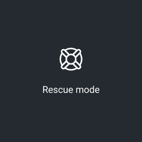
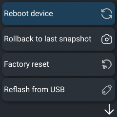
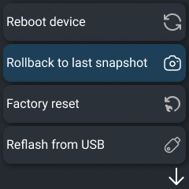
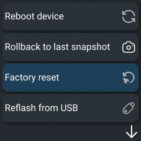
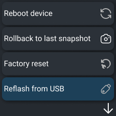
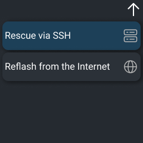
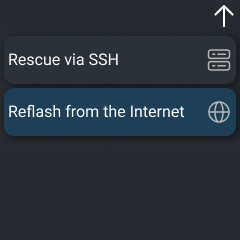

# Factory reset on Turris Omnia NG

The Turris Omnia NG router has a reset button on its back panel. When you press
and immediately release the reset button, the router resets and boots into
ordinary Turris OS ([mode 1](#standard-reboot)). To enter other reboot modes,
press the reset button and hold the D-Pad in any direction, and wait
for a rescue mode image to show up on the display.

Once the rescue mode finishes booting, menu will show up. In the menu, it is
possible to select the next action using the D-Pad. Movement up and down selects
the next/previous item in the menu, while pressing the D-Pad executes the action.

Available modes:

* Standard (re)boot
* Rollback to the latest snapshot
* Rollback to factory
* Re-flash router from flash drive
* Unsecure SSH on 192.168.1.1
* Flash from the internet

!!! warning
    When the indication LEDs turn red, it means that some highly sensitive
    operation is in process and data may be corrupted if it is interrupted. Try
    not to reset the router during the process or you might end up with a corrupted
    filesystem. That one can be fixed using [mode 4](#re-flash-router) or
    with [mode 6](#re-flash-router), but with complete data loss.

## Standard (re)boot

{: align=right }

The router is going to reboot. During the boot process the power LED turns green,
then yellow, and green again. When the boot process is completed, the dashboard will
show up on the device display.

## Rollback to latest snapshot

{: align=right }

This mode may help in situations when you lose network connectivity to your
Turris Omnia NG router during experiments or due to any other reason that is
bound to the internal state of the router. You can simply return to the latest
snapshot of the running system by selecting the proper reset mode. For more
information about the snapshots, please visit
[schnapps](../../geek/schnapps/schnapps.md).

During the course of the operation, the indication LED is going to turn red,
the busy indicator is going to show on the display. From this moment, the router
must not be restarted or powered off. When the rollback operation is completed,
the router automatically restarts.

!!! tip
    Your current state is saved in a snapshot. You can later cherry-pick changes
    you still want by using [Schnapps](../../geek/schnapps/schnapps.md).

## Rollback to factory reset

{: align=right }

All data, settings and software in the internal storage of the router are
erased and replaced by the factory defaults. Internally, the file system rolls
back to a special snapshot (the one that has been created in the
factory). Please use this mode when you lose your password and all means of
access to the router or when returning to the latest snapshot (mode 2) is not
sufficient to repair the broken system.

Indication of the process progress is the same as in the case of rollback to the
latest snapshot (mode 2).

!!! tip
    Your current state is saved in a snapshot. You can later cherry-pick changes
    you still want by using [Schnapps](../../geek/schnapps/schnapps.md).

!!! tip
    You can achieve the same results by calling `schnapps rollback factory` from
    the CLI.

## Re-flash router

{: align=right }

!!! warning
    This operation erases all settings and all data stored in the router.
    Including old snapshots.

If the Turris Omnia NG router's operating system is broken beyond repair or if you
want to avoid long upgrades during initial setup, please use the following
method to restore the operating system image.

Download the latest version of Turris Omnia NG's system image from
[the repository](https://repo.turris.cz/hbs/medkit/omnia-ng-medkit-latest.tar.gz).
Save the file `omnia-ng-medkit-latest.tar.gz` to a USB flash drive to the root
directory. The Turris Omnia NG router supports the following filesystems: _ext4, Btrfs,
XFS, and FAT32_. You can also download and put alongside the
[sha256](https://repo.turris.cz/hbs/medkit/omnia-ng-medkit-latest.tar.gz.sha256)
or [sig](https://repo.turris.cz/hbs/medkit/omnia-ng-medkit-latest.tar.gz.sig)
file. Connect the USB flash to the Turris Omnia NG router and boot to the rescue mode.

The Turris Omnia NG router will rewrite internal eMMC storage with the system
image from the USB flash drive.

The process of rewriting the internal storage takes considerably longer than
snapshot rollback in the previous cases. However, the indication of the process
progress is the same as in the case of rollback to the latest snapshot (mode 2).

When the process has completed the task, you may remove the USB flash.

## Unsecure SSH on 192.168.1.1

{: align=right }

!!! warning
    When used incorrectly, this operation exposes your Omnia NG unprotected on
    the internet. Make sure to unplug all untrusted computers and the internet
    connection first.

This mode is meant to help you debug your issues without the need for a serial cable
or rolling back snapshots. Before entering this mode, make sure that only your
computer is directly connected to the ETH3 port.

When it starts, Omnia NG will set up an IPv4 network on its ETH3 interface with
a static IP address `192.168.1.1/24`. Pick a random IP address from the same
network (for example `192.168.1.2/24`) and set it up manually on your computer.
After that, you should be able to SSH as root to your router without needing to
enter a password. You will end up in rescue mode with limited capabilities, but
you have [Schnapps](../../geek/schnapps/schnapps.md) at your disposal, and you
can mount rootfs from your micro SD card and do any changes you need.

After finishing your fixes, don't forget to unmount any mounted filesystems and
reboot the router.

## Flash from the internet

{: align=right }

!!! warning
    This operation erases all settings and all data stored in the router.
    Including old snapshots.

If the Turris Omnia NG router operating system is broken beyond repair or if you
want to avoid long upgrades during initial setup, please use the following
method for restoring the operating system image.

The Turris Omnia NG router will rewrite the content of the internal memory with the
system image downloaded from the internet.

To use this mode, you need to plug your Turris Omnia into a network where it can
get an internet connection using DHCP. It will try to use only the ETH0 or the
SFP0 port. Once it gets online, it will download the latest medkit from our website
alongside its signature. Verifies it, and if everything works well, it
will reflash itself.

The process of rewriting the internal memory takes considerably longer than
snapshot rollback in mode 4.
