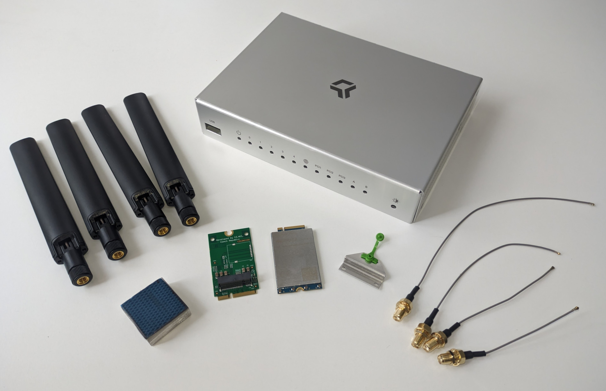
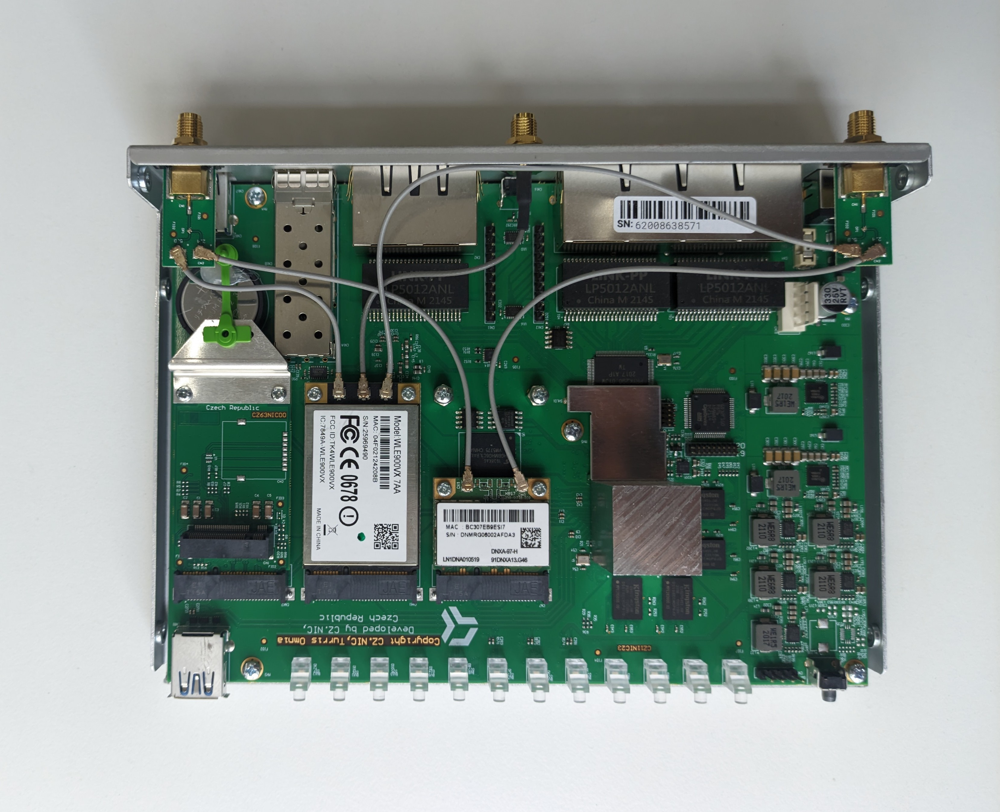
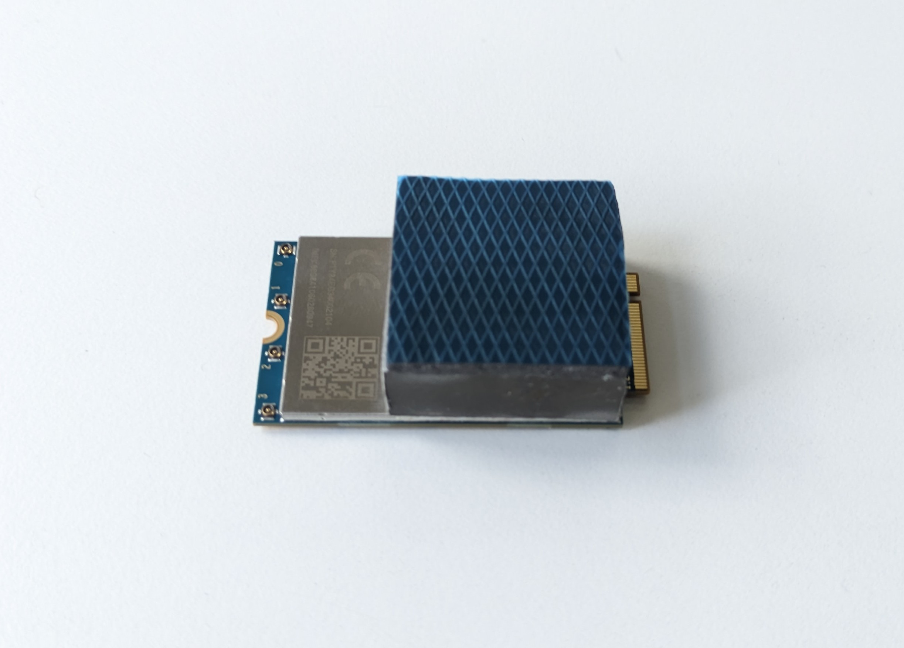
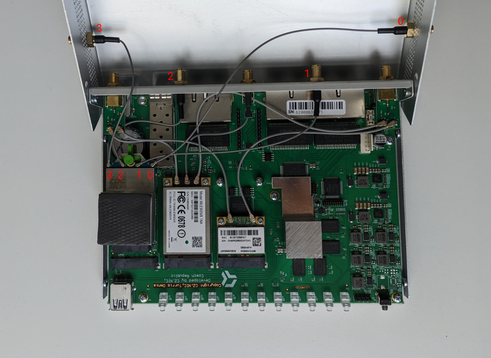
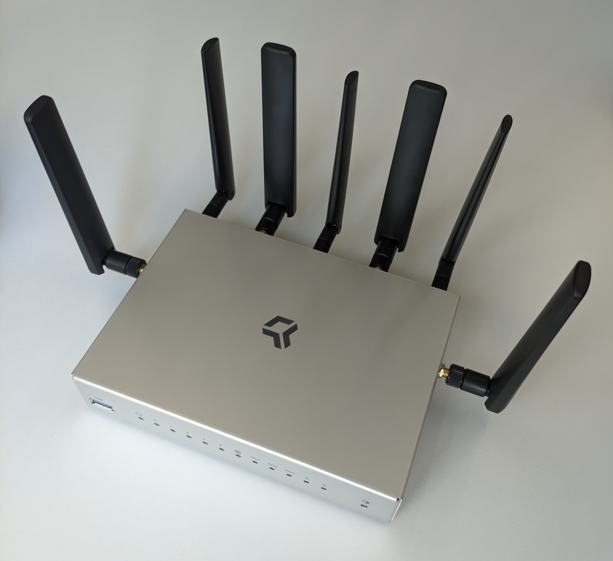

# Turris Omnia 5G upgrade kit setup

!!! warning
    This upgrade is intended for users with advanced technical expertise.
    The hardware installation requires a certain degree of manual dexterity.

!!! notice
    Please note that the Turris Omnia 5G upgrade kit is not officially
    supported on Turris Omnia Wi-Fi 6 due to the number of antennas. However,
    all revisions of Turris Omnia released between 2016 and 2020 are supported,
    as well as all NO Wi-Fi and 4G versions.

!!! warning
    To use 5G kit, USB 3.0 is needed and thus the front USB port on your Omnia
    will no longer be available after successful installation of 5G kit.

## Content of the 5G kit

The 5G kit contains everything you need to connect your Omnia router to the 5G network,
except of the SIM card. Ask your telco operator for that.

It contains:

* 4 pigtails of various length
* 4 5G antennas
* 1 heatsink
* 1 mPCIe to M.2 adapter
* 1 metal riser
* 1 5G modem Quectel RM500U-EA
* 1 new top cover with extra holes

## Installation

!!! tip
    Want to watch the assembly process?
    Check out our step-by-step video tutorial:
    <video controls width="795" style="margin-top: 1em">
      <source src="https://static.turris.com/docs/omnia/5g-kit.mp4" type="video/mp4">
      <source src="https://static.turris.com/docs/omnia/5g-kit.mpeg" type="video/mpeg">
      <source src="https://static.turris.com/docs/omnia/5g-kit.webm" type="video/webm">
      <track default src="https://static.turris.com/docs/omnia/5g-kit.vtt" kind="captions" srclang="en" label="English">
    </video>

1. Ensure that your Turris Omnia isn't plugged into the power supply.

2. Insert your 5G SIM card. Make sure that it doesn't require a PIN to be entered.

3. Install the mPCIe to M.2 B key adapter to the leftmost mPCIe slot
   together with the modem riser.

    !!! warning
        If you own a Turris Omnia with soldered stand-offs, make sure to use
        the included washers to maintain proper distance from the SFP cage.

    

4. Stick the heatsink cube to the modem on the edge of the modem heatsink on the
   M.2 connector side, as in the picture.

    

5. Insert the 5G modem with heatsink into the M.2 slot and secure it with the
   plastic pin on the modem riser.

6. Install the pigtails. Two of them go directly to the case, two more to the top cover.

    1. Install the pigtails as pictured.

        * Pigtail 0 is 20.5 cm (right side of the top cover)
        * Pigtail 1 is 14.5 cm (right side of the case back)
        * Pigtail 2 is 9.5 cm (left side of the case back)
        * Pigtail 3 is 11.5 cm (left side of the top cover)

    

7. Take off the protective foil from the thermal gum on top of the heatsink.

8. Put the router back together.

9. Install the 5G antennas.

10. Power on the router. Go to the _Package Management_ -> _Packages_ and
    select _5G kit_ support. Save your options and wait for the software
    support to be installed. You need to be connected to the Internet by some
    other means for this to work.

    

11. Wait for the installation to complete and for notification about the update to
    show up. Then reboot your router, and once it boots up, you should have your
    5G modem setup as a backup connectivity.

