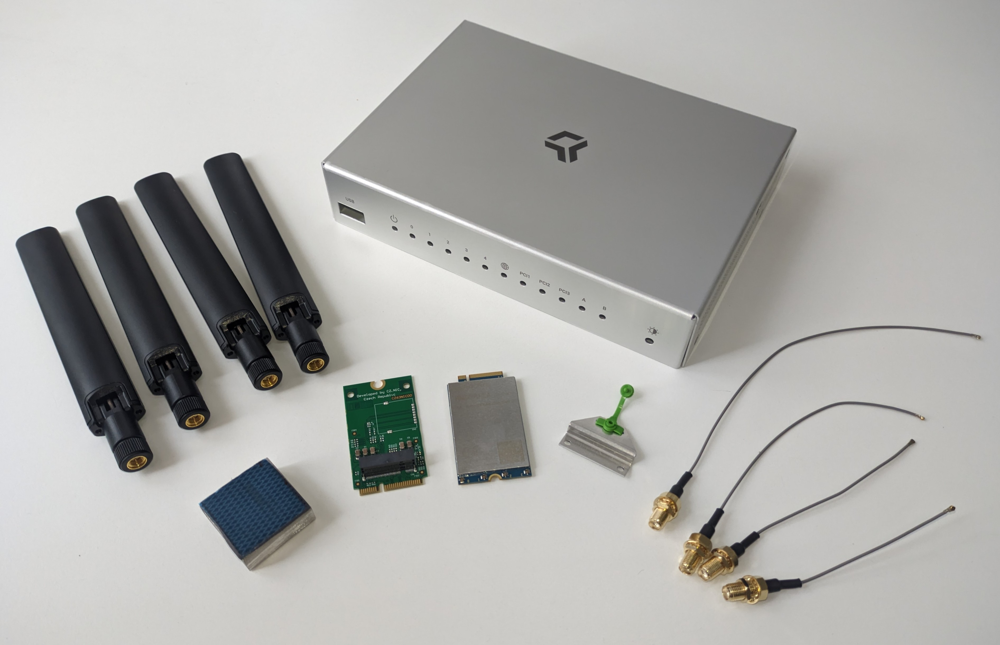

# Turris Omnia add-ons

Omnia is a very powerful device in and of itself. You may find the add-ons very
useful when your network requirements are higher than what is in standard
versions.

## Turris Omnia LTE kit

!!! info
    It is not yet possible to setup LTE in the reForis GUI, however you are
    able to use the below manual to set it up over ssh.

In order to use LTE, you need to equip your Omnia with an LTE modem.
Turris Omnia LTE kit is based on the miniPCI card with modem chip Quectel EP06,
so an LTE module category 6 optimized for M2M and IoT applications. It provides
maximum of 300 Mb/s downlink and 50 Mb/s uplink speeds.

You will find the guide on how to setup the LTE connection
over [here](../../../geek/lte/index.md).

## Turris Omnia 5G kit

!!! info
    It is not yet possible to setup 5G in the reForis GUI. However you can
    use the manual below to set it up.

!!! warning
    Due to the number of antennas, Turris Omnia 5G kit is not compatible with
    Turris Omnia Wi-Fi 6.

In order to use 5G, you need to equip your Omnia with a 5G modem. However,
most 5G cards use four antennas and an M.2 slot. Therefore Turris Omnia
5G kit contains a new top cover (and is **NOT compatible with Turris Omnia Wi-Fi
6**) and an M.2 to mPCIe adapter as well. It is based on the M.2 card with the modem
chip Quectel RM500U-EA, so it is a sub-6GHz 5G module optimized for IoT/eMBB/URLLC
applications. With the 3GPP Release 15/Release 16 technology, it supports both
5G NSA and SA modes and is backward compatible with 4G/3G networks.

You will find the guide on how to setup the 5G kit over [here](../5g.md).

## Turris Omnia Wi-Fi 6 upgrade kit

!!! info
    The Turris Omnia Wi-Fi 6 upgrade kit can be used to upgrade Turris Omnia
    routers manufactured since 2016. It can be used in all models – Omnia
    1GB, Omnia 2GB, Omnia 2019, and Omnia 2020.

The kit is based on Dual Band WiFi 6 card AW7915-NP1,
miniPCI-e bus with 4× u.Fl connectors, WPA2 encryption support,
modulation speed 2401 Mbps in the 5GHz band (4×4 MU-MIMO)
or 574 Mbps in the 2,4GHz band (2×2 MU-MIMO).
This kit comes also with a special cover with special holes for additional
antennas, longer pigtails, and an extra antenna.

## Turris Omnia 5G upgrade kit

!!! info
    Please note that the Turris Omnia 5G upgrade kit is not officially
    supported on Turris Omnia Wi-Fi 6 due to the number of antennas. However,
    all revisions of Turris Omnia released between 2016 and 2020 are supported,
    provided that the latest U-Boot is installed.

!!! warning
    This upgrade is intended for users with advanced technical expertise.
    The hardware installation requires a certain degree of manual dexterity,
    and the software setup requires a fundamental understanding of Linux
    command line.

This kit is based on the M.2 Quectel RM500U-EA 5G modem card, which provides
maximum data rates of 2.6 Gb/s downlink and 1 Gb/s uplink. As all Turris Omnia
revisions up until the 2020 revision feature only mPCIe slots, the upgrade kit
includes an mPCIe reduction to the M.2 B key. The kit also features four antennas,
four pigtails (9.5 cm, 11.5 cm, 14.5 cm, and 20.5 cm), a cooler cube, a modem
riser, and a case cover with holes for additional antennas.
