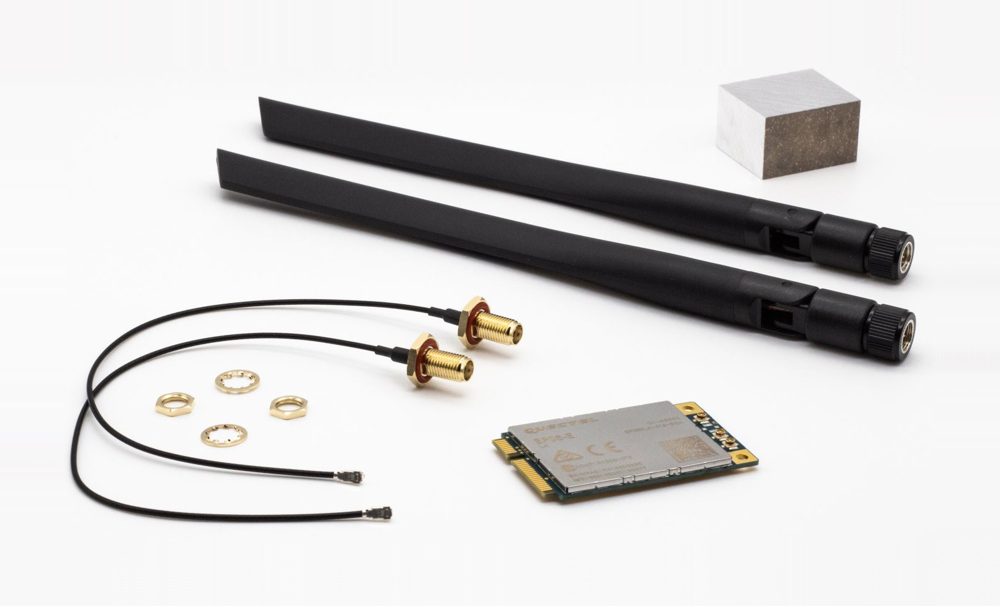

# Turris Omnia add-ons

Omnia is a very powerful device in and of itself. You may find the add-ons very
useful when your network requirements are higher than what is in standard
versions.

## Turris Omnia LTE kit

!!! info
    It is not yet possible to setup LTE in the reForis GUI, however you are
    able to use the below manual to set it up over ssh.

In order to use LTE, you need to equip your Omnia with an LTE modem.
Turris Omnia LTE kit is based on the miniPCI card with modem chip Quectel EP06,
so an LTE module category 6 optimized for M2M and IoT applications. It provides
maximum of 300 Mb/s downlink and 50 Mb/s uplink speeds.

You will find the guide on how to setup the LTE connection
over [here](../../../geek/lte/index.md).

## Turris Omnia Wi-Fi 6 upgrade kit

!!! info
    The Turris Omnia Wi-Fi 6 upgrade kit can be used to upgrade Turris Omnia
    routers manufactured since 2016. It can be used in all models – Omnia
    1GB, Omnia 2GB, Omnia 2019, and Omnia 2020.

The kit is based on Dual Band WiFi 6 card AW7915-NP1,
miniPCI-e bus with 4× u.Fl connectors, WPA2 encryption support,
modulation speed 2401 Mbps in the 5GHz band (4×4 MU-MIMO)
or 574 Mbps in the 2,4GHz band (2×2 MU-MIMO).
This kit comes also with a special cover with special holes for additional
antennas, longer pigtails, and an extra antenna.
