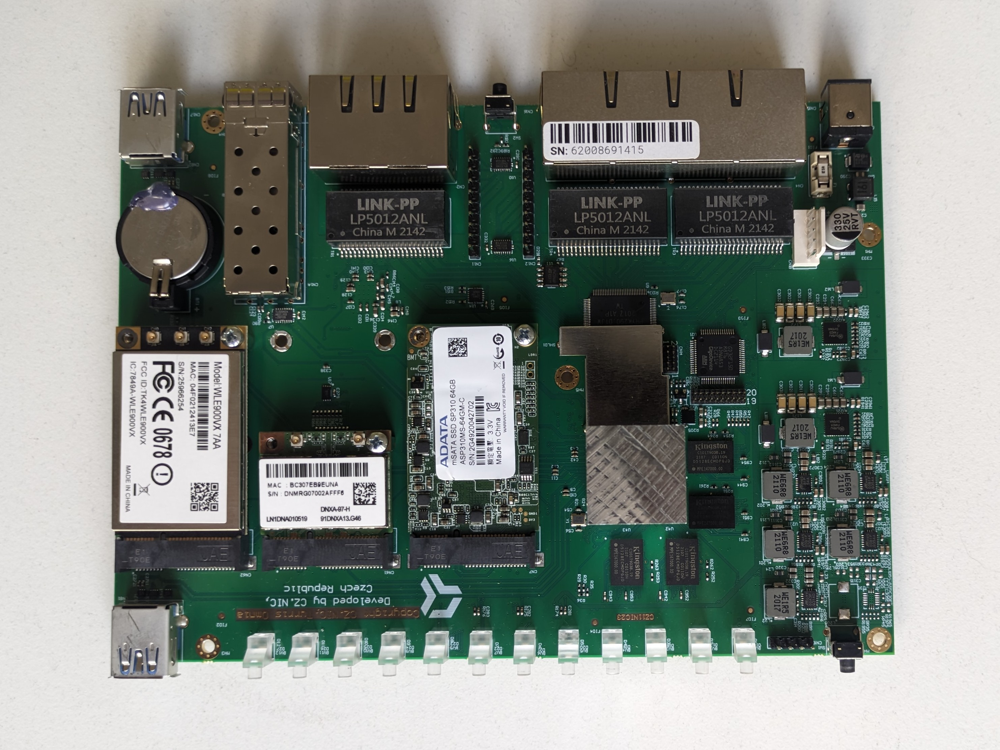

# Booting Turris Omnia from an mSATA SSD

This guide details creating a system that runs entirely from an mSATA
SSD drive, bypassing the onboard NAND memory. The target system can
either be a backup of your current system or a clean version of Turris OS.

!!! warning
      This guide is only for Omnia 2019 or newer. For older series, please
      install the `turris-nor-update `package and run the `nor-update` command
      from CLI or update your NOR via [serial cable](serial-boot.md#nor-recovery).

      After setting up boot from SSD, you should avoid using the LuCI
      mount plugin as it tries to unmount all external drives including
      your SSD, and that would break your system until a reboot.

!!! notice
      After setting up boot from SSD, parts of the rescue modes will not
      be usable, like reverting to the previous snapshot and factory
      reset. You can still manage your snapshots manually using
      [schnapps](../../geek/schnapps/schnapps.md).

## Requirements

* a [Turris Omnia](./omnia.md) router,
* an mSATA SSD drive,
* an Internet connection,
* a PH2 and PH1 screwdriver,
* a [serial console cable](../serial.md)

## Hardware installation

1. Make sure your Omnia is not connected to the power supply.
2. Unscrew the six PH2 screws securing the top cover.
3. Remove the top cover by sliding it out towards the front of the
   device, in order to avoid damaging the LED light pipes.
4. Move the already present PCIe cards by one position towards the SIM
   card slot.
5. Insert your mSATA SSD into the remaining slot (the one which is
   closest to the heatsink of the CPU), as it is the only one that
   supports the mSATA interface.

!!! tip
    Because it's a complex operation (which includes many steps) you can
    utilize our video guide:

    <video controls width="795">
	<source src="https://static.turris.com/docs/omnia/omnia-ssd.mp4" type="video/mp4">
	<source src="https://static.turris.com/docs/omnia/omnia-ssd.mpeg" type="video/mpeg">
	<source src="https://static.turris.com/docs/omnia/omnia-ssd.webm" type="video/webm">
    </video>



## Device detection

1. Plug your Omnia into the power supply.
2. Connect to the router via SSH, or [via a serial console](../serial.md#turris-omnia).
3. Check whether the new SSD can be detected:
   ```bash
   fdisk -l | grep "sd"

   # It should display info about the disk:
   Disk /dev/sda: 238.47 GiB, 256060514304 bytes, 500118192 sectors
   ```

## Preparation of the SSD

!!! notice
      If you can no longer access your eMMC, or if you simply want to
      start with a clean system, you can use a [medkit](https://repo.turris.cz/hbs/medkit/omnia-medkit-latest.tar.gz).
      Instead of backing up your system in step 1, skip to step 2.

1. Backup the current filesystem by creating and exporting a [snapshot](../../geek/schnapps/schnapps.md).
   ```bash
   schnapps export -c /tmp/backup.tar.gz
   ```
2. Run `fdisk` to partition the SSD.
   ```bash
   fdisk /dev/nvme0n1
   ```
3. Create a new `dos` or `GPT` partition table by typing `o` or `g`.
4. Create a new primary partition by typing `n`. Its size must be at
   least the same as the original one present on the eMMC (e.g., 8 GB).
5. Write the changes by typing `w`.
6. Create a filesystem on the new partition:
   ```bash
   mkfs.btrfs /dev/sda1
   ```
7. Create a mount point and mount the partition on it:
   ```bash
   mkdir -p /mnt/ssd && mount /dev/sda1 /mnt/ssd
   ```
8. Create a Btrfs subvolume for the root directory:
   ```bash
   btrfs su cr /mnt/ssd/@
   ```
9. If you created a backup in step 1, unpack it into the new subvolume:
   ```bash
   tar -C /mnt/ssd/@ -xvzf /tmp/backup.tar.gz
   ```
   Or if you are starting with a clean system, unpack a current medkit
   into the new subvolume:
   ```bash
   wget -O - https://repo.turris.cz/hbs/medkit/omnia-medkit-latest.tar.gz | tar -C /mnt/ssd/@ -xvzf -
   ```
10. Create a symlink to the boot.scr file:
   ```bash
   cd /mnt/ssd && ln -s @/boot/boot.scr .
   ```
11. Leave the directory and unmount the SSD:
   ```bash
   cd && umount /mnt/ssd
   ```

## Updating U-Boot to boot from the SSD

In order to boot from the SSD prepared in the previous steps, you need
to modify the U-Boot environment.

1. Connect to your Omnia [via a serial console](../serial.md#turris-omnia).
2. Reboot the device and start pressing `Enter` repeatedly until the
   U-Boot prompt appears:
   ```bash
   =>
   ```
3. Run `printenv` to check the original `boot_targets` environment variable:
   ```bash
   printenv boot_targets

   # The output:
   boot_targets=mmc0 scsi0 usb0 pxe dhcp
   ```
4. Set the variable, so that NVMe is preferred over eMMC for the next boot:
   ```bash
   setenv boot_targets scsi0 mmc0 usb0 pxe dhcp
   ```
   You are setting this environment variable temporarily for this boot
   only, so you won't get stuck with an unbootable device.
5. Boot to the system on the SSD:
   ```bash
   run distro_bootcmd
   ```
6. After the system boots up, run the `mount` command to display what is
   actually mounted:
   ```bash
   mount

   # The output should look like this:
   /dev/sda1 on / type btrfs (rw,noatime,ssd,discard=async,space_cache=v2,commit=5,subvolid=256,subvol=/@)
   ```
7. If everything went well, rerun the `setenv` command from step 4 and
   then write the environment variable permanently by running:
   ```bash
   saveenv
   ```
8. Reboot your device by:
   ```bash
   run distro_bootcmd
   ```

!!! notice
      In case of an update of the U-Boot and its environment in one of
      our future releases, your setup could be overriden and hence you
      would need to repeat the above steps to configure the U-Boot again.

!!! info
      The `boot_prefixes` variable specifies where to search for the
      boot directory (which is located on the `@` subvolume now),
      whereas `boot_targets` defines the boot sequence,

## Creating a factory image

The last thing to do is to create a factory image, so you have something
to return to if you run into trouble.

You just need to run:
```bash
schnapps update-factory
```
To rollback to the factory version, use the *Factory reset* button in
[reForis](../../basics/reforis/maintenance/maintenance.md#factory-reset)
or the `schnapps rollback factory` command.

## Credits

This guide utilizes instructions originally written by
[drhm](https://forum.turris.cz/u/drhm) on our
[forum](https://forum.turris.cz/t/boot-from-ssd-outdated-description/14510/11).
