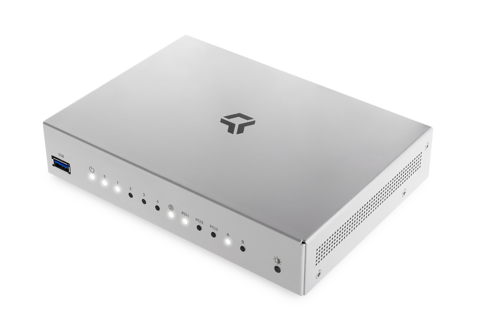
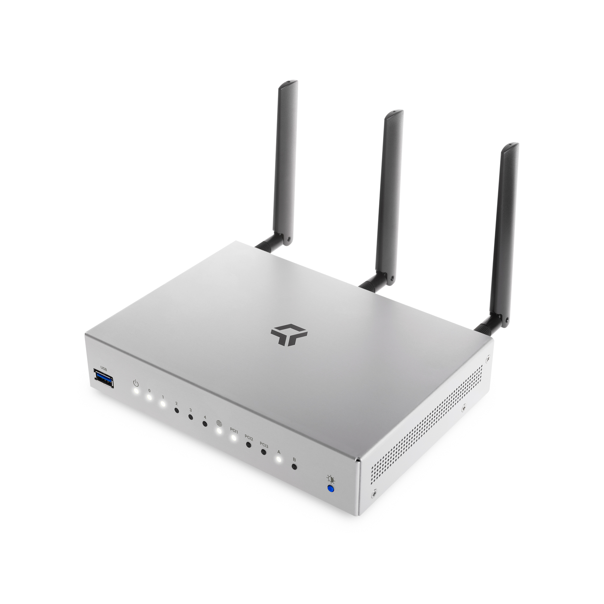
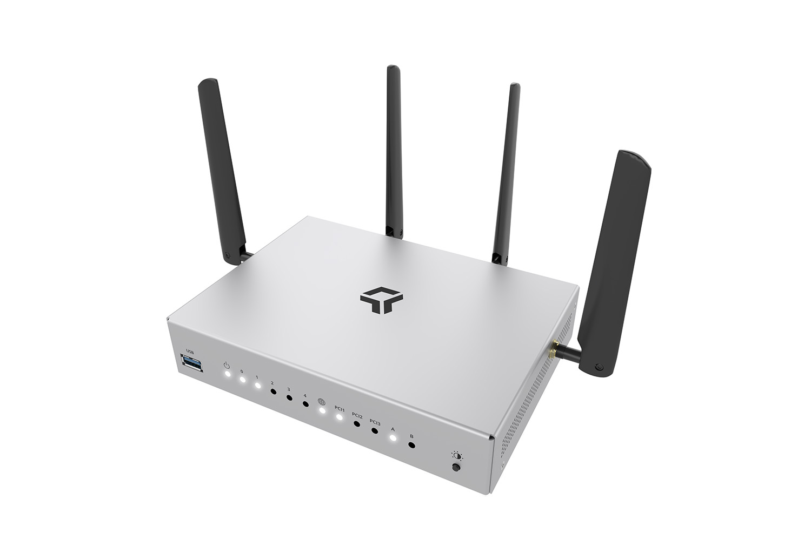
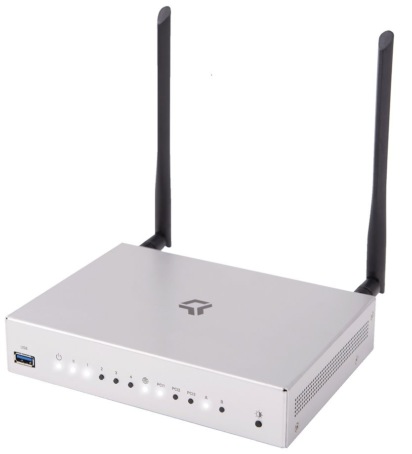

# Turris Omnia

## Omnia platform

Turris Omnia platform is a starting point for any of our powerful SOHO routers.
It is based on **Marvel Armada 385 CPU** - dual-core armv7 running at **1.6 GHz**.
The current version has **two gigs of RAM**. It uses as main storage **8 GB eMMC**.
There are three miniPCIe slots that provide options for upgrades. One comes with
a SIM card slot.

During the course of history, it was possible to buy Turris Omnia with just one
gig of RAM and also without WiFi.

### Network interfaces

Turris Omnia platform has three physical Ethernet ports. One of them (_eth2_) is
dedicated to WAN and connected directly to the WAN port. That can be either metallic
or SFP. If you plug in the SFP module, the metallic port will get disconnected. If
you unplug the module, the metallic port will be functional again. In Turris OS 3.X
this can be done at runtime, on newer version changing the configuration
requires reboot.

!!! warning
    In Turris OS 3.X the names of the _eth1_ and _eth2_ interfaces were
    reversed. So in Turris OS 3.X, _eth1_ was the one connected to WAN. We had
    to rename them in Turris OS 4 due to fixes in the vanilla kernel.

The remaining two ports are connected to a fully manageable switch as shown on
the picture below.

### GPIO and friends

Turris Omnia currently sold in retail and all Omnias sold via Indiegogo
campaign contain an extension header providing various embedded buses. There was a
brief period of time, when connectors for those were not equipped. If you bought
Omnia without the header, extending it is much more complex task than just
adding the header.

## Turris Omnia NO Wi-Fi

A basic version of the router without any WiFi card. Suitable to be put into
a rack or as a main connectivity gateway in a larger building.

## Turris Omnia 2020

Turris Omnia 2020 comes with two WiFi cards to provide wireless connectivity.
For **5GHz AC WiFi** bands, it contains a Compex WLE900VX card based
on Qualcomm Atheros QCA988x chipset (ath10k). To provide access to older
devices capable only of **2,4 GHz** it is also equipped with a Compex WLE200N2 card
based on Qualcomm Atheros AR9287 (ath9k).

## Turris Omnia Wi-Fi 6

The set of WiFi cards in this device consists of AW7915-NP1 based on Mediatek MT7915AN
which provides **5 GHz WiFi 6**. As a fallback for older devices with **2,4 Ghz**
connectivity, it is equipped with DNXA-97-H that is also based on the Qualcomm Atheros AR9287
chip. The only reason we are not using Compex WLE200N2 in Omnia WiFi 6 is that the card
is no longer available.

## Turris Omnia 4G

This router comes equipped with a Quectel EP06 LTE card. After inserting a SIM
card with no PIN, this device can connect you to the Internet via the **CAT 6 LTE**
card or use it as a backup for your main connectivity.

## Manuals

* [Original printed manual](https://static.turris.com/docs/omnia/omnia-manual-en.pdf)
* [Wi-Fi 6 Upgrade kit installation guide (CZ,EN)](https://static.turris.com/docs/omnia/Wi-Fi_6_upgrade_kit_installation_manual.pdf)

## Datasheets

### Omnia Wi-Fi 6

* [Official datasheet – English](https://secure.nic.cz/files/Turris-web/Omnia/Omnia_wifi6_datasheet_EN.pdf)
* [Official datasheet – German](https://secure.nic.cz/files/Turris-web/Omnia/Omnia_wifi6_datasheet_DE.pdf)
* [Official datasheet – Czech](https://secure.nic.cz/files/Turris-web/Omnia/Omnia_wifi6_datasheet_CS.pdf)

### Omnia 4G

* [Official datasheet – English](https://secure.nic.cz/files/Turris-web/Omnia/Turris_Omnia_4G_datasheet_EN.pdf)
* [Official datasheet – German](https://secure.nic.cz/files/Turris-web/Omnia/Turris_Omnia_4G_datasheet_DE.pdf)
* [Official datasheet – Czech](https://secure.nic.cz/files/Turris-web/Omnia/Turris_Omnia_4G_datasheet_CS.pdf)

### Omnia No Wi-Fi

* [Official datasheet – English](https://secure.nic.cz/files/Turris-web/Omnia/Omnia_NO_wifi_datasheet_EN.pdf)
* [Official datasheet – German](https://secure.nic.cz/files/Turris-web/Omnia/Omnia_NO_wifi_datasheet_DE.pdf)
* [Official datasheet – Czech](https://secure.nic.cz/files/Turris-web/Omnia/Omnia_NO_wifi_datasheet_CS.pdf)

### Legacy

* [Official datasheet for Turris Omnia 2020](https://static.turris.com/docs/omnia/omnia2020-datasheet.pdf)
* [Official datasheet for Turris Omnia 2019](https://static.turris.com/docs/omnia/omnia2019eu-datasheet.pdf)

## Various documentation files

### Schematics

* [Schematics for Turris Omnia CZ11NIC23](https://static.turris.com/docs/omnia/CZ11NIC23-schematics.pdf)
* [Schematics for Turris Omnia CZ11NIC20](https://static.turris.com/docs/omnia/CZ11NIC20-schematics.pdf)
* [Schematics for Turris Omnia CZ11NIC13](https://static.turris.com/docs/omnia/CZ11NIC13-schematics.pdf)

### Declaration of Conformity

* [Turris Omnia Wi-Fi 6](https://static.turris.com/docs/omnia/doc-omnia-wifi6.pdf)
* [Turris Omnia 4G](https://static.turris.com/docs/omnia/doc-omnia-4g.pdf)
* [Turris Omnia No Wi-Fi](https://static.turris.com/docs/omnia/doc-omnia-nowifi.pdf)
* [Turris Omnia 2020](https://static.turris.com/docs/omnia/Omnia-DoC.pdf)

### Other documents

* [3D model of Turris Omnia PCB](https://static.turris.com/docs/omnia/omnia-step3d.zip)
* [Diplexers (Wi-Fi signal mixers) – source files](https://static.turris.com/docs/omnia/diplexers-source-v1.zip)
