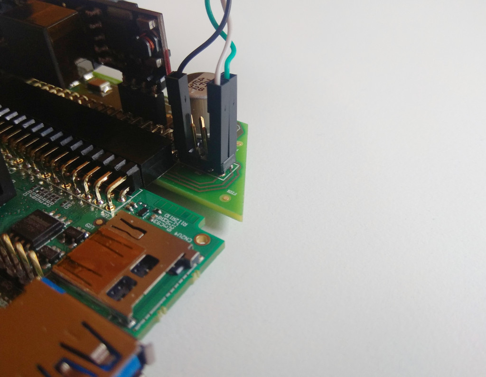
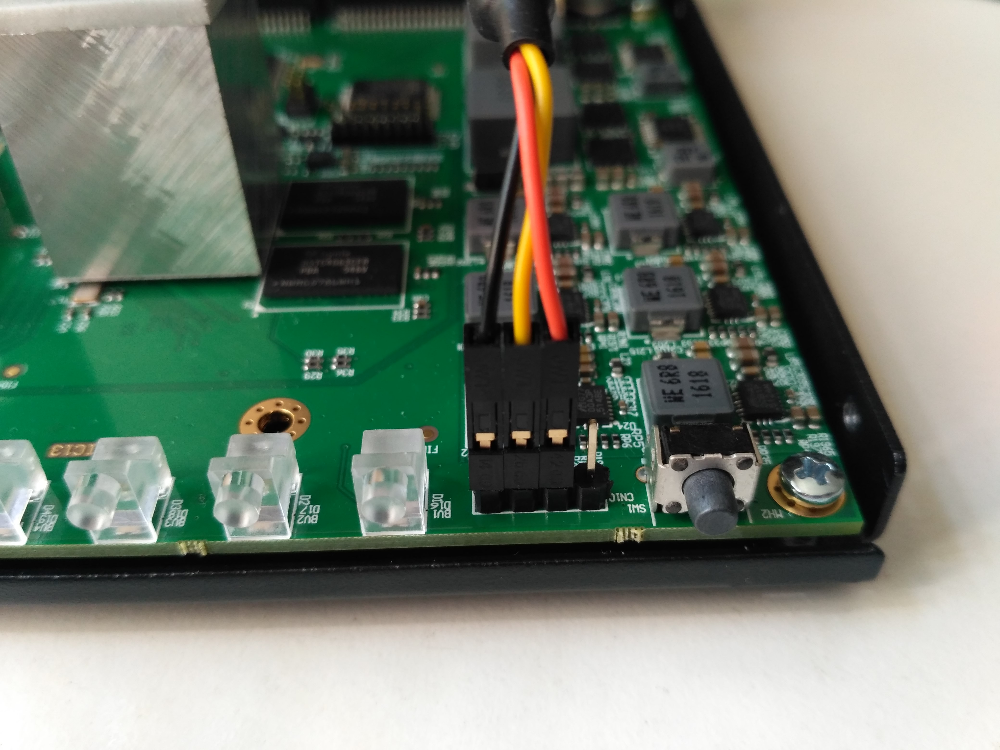
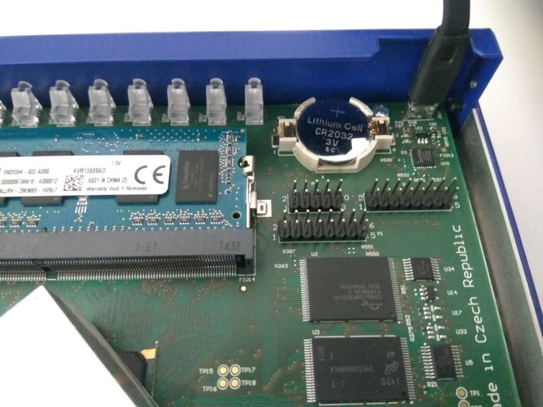
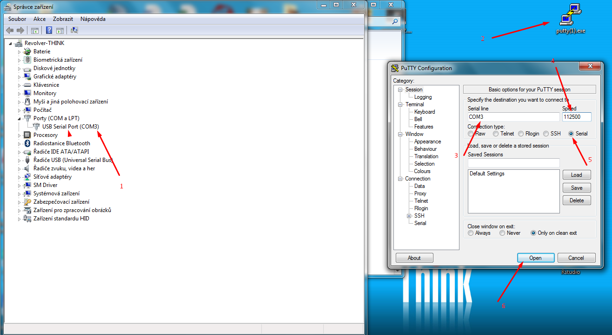

# Serial connection

!!! warning
    This tutorial is mainly for advanced users. You can damage your router if you make a mistake.

The router has a serial link which can be used to control the router and
monitor error reports. It also displays the booting progress and it doesn't
require networking to be set up properly.

## Hardware

### Turris MOX

!!! warning
    The UART cable for Turris MOX *requires 1.8V logic*. Most common UART
    cables are 3.3V or 5V. Make sure you have correct cable before connecting
    it, otherwise you will permanently damage your router!

The pins for UART are exposed on GPIO header. Following pins can be used to
access UART:

|Pin |Signal|UART cable                    |
|---:|:----:|:-----------------------------|
|  5 | GND  |black wire                    |
|  6 | +1V8 |red wire - **only if needed** |
| 13 | RX   |white wire                    |
| 14 | TX   |green wire                    |

Take extra care when connecting the red wire. On some cables, this is directly
connected to +5V USB power. If that is the case, connecting it will fry the MOX.
However on some cables like 6-wire USB cable supplied in some hacker packs, the
red wire powers the cable itself and has to be connected to a +1V8 pin.

If you have PoE addon, you can find pins on addon itself. In this case it is:

|Pin |Signal|UART cable                    |
|---:|:----:|:-----------------------------|
|  1 | GND  |black wire                    |
|  2 | +1V8 |red wire - **only if needed** |
|  7 | RX   |white wire                    |
|  8 | TX   |green wire                    |

### Turris Omnia

To access the serial link you need to remove the top cover.
To do it, first you have to unscrew 6 screws (3 on each side of the router). 
The serial pins are in the right
bottom corner of the board, between the right most LED and the LED control
button. Connect it to you PC using a USB TTL serial adapter as shown on the
photo - from the left the colors of the pins should be black (GND), yellow
(RX), orange (TX). The specific cable used in this manual is the Raspberry Pi
Cable, TTL-232R-RPI.

### Turris 1.X

Turris 1.0 and 1.1 have the easiest access to the serial port. They already
have micro USB connector on board on the left front side. You still need to
remove the cover to get access to it, but afterward, all you need is to connect
a micro USB cable and you are ready.

## Software

### UNIX

In case of UNIX-like systems you can use `screen` to connect to your device. In
general, you need to figure out the name of your USB serial port - in case of
Linux it is usually `/dev/tyyUSB0`, but if you already had some serial device
(modem, some development board, ...) it might be even higher number. It should
show up in `dmesg` after connecting the cable.

To be able to connect to it, you will also need enough rights. Depending on
your system configuration, you might need to add yourself to some group and
logout/login or setup some `udev` rules. Other option is to try it as root, which
is not recommended but will most likely work.

To connect to the serial port, simply type in your terminal following commands:

`screen /dev/ttyUSB0 115200`

If your serial port is not `/dev/tyyUSB0`, replace it with the correct path.

### MS Windows

On MS Windows, you can use PuTTY to access the serial port. See the following
screenshot for details.

### Using it

When successfully connected, you'll see empty black screen. Only after pressing
enter, you'll get announcement that you are on Turris router and you'll get
shell prompt.

You are now root on your device and you can do whatever you like and you don't
have to be afraid of loosing control when misconfiguring network.

Few notes. Applications might not get your terminal size, so graphical
applications like Midnight Commander or Top might look bad. Also when
disconnecting serial cable, your prompt stays in the state you left it in, so
programs keep running and if you left running some long time running task, it
will be there when you reconnect the serial cable so enter will not get you
prompt, but you might need to kill the application first (for example by using
Ctrl+C).
