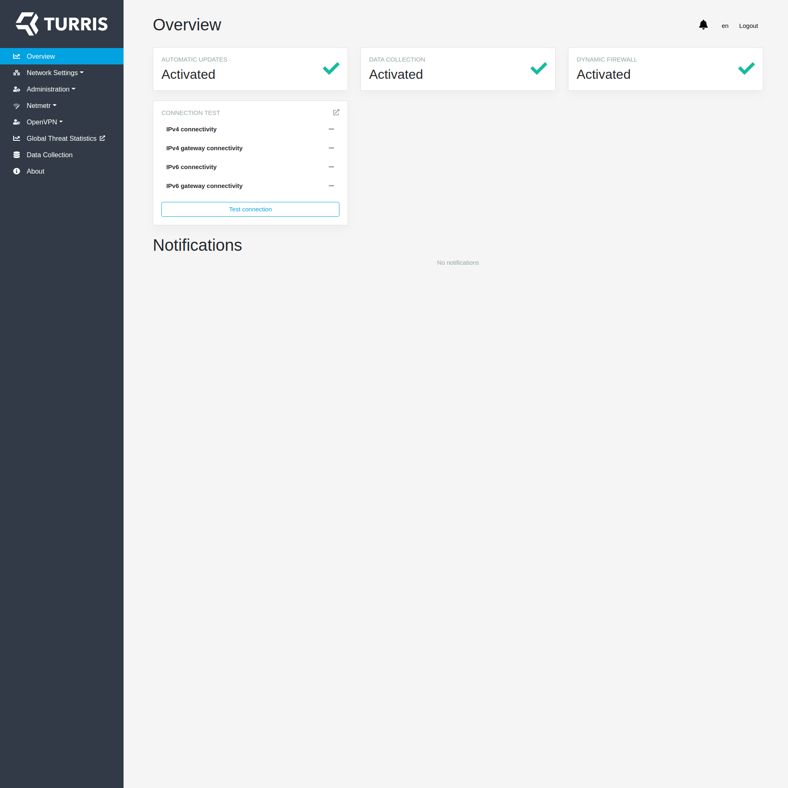
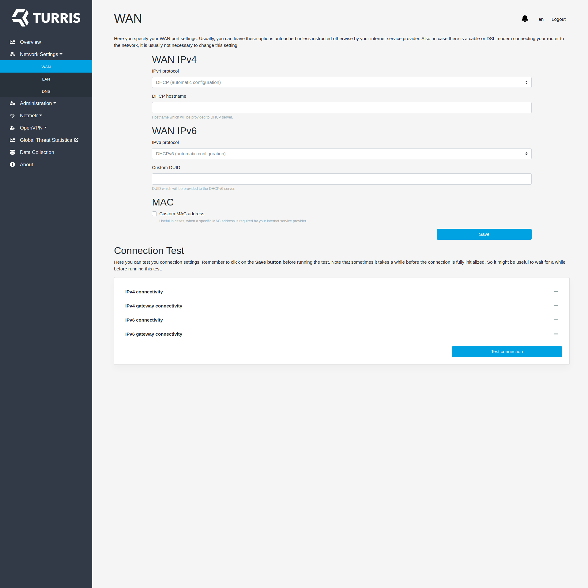
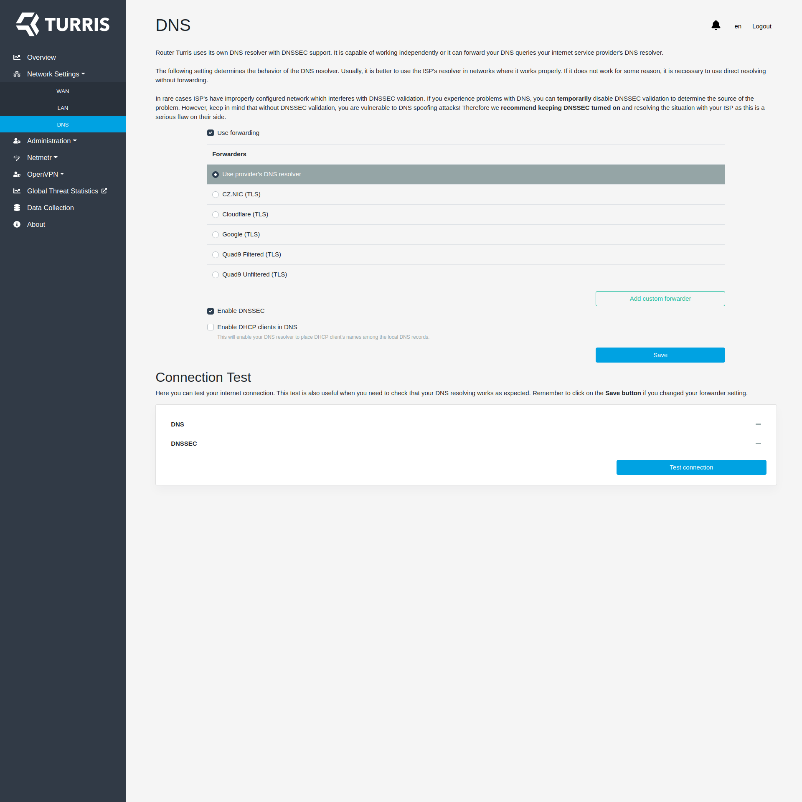
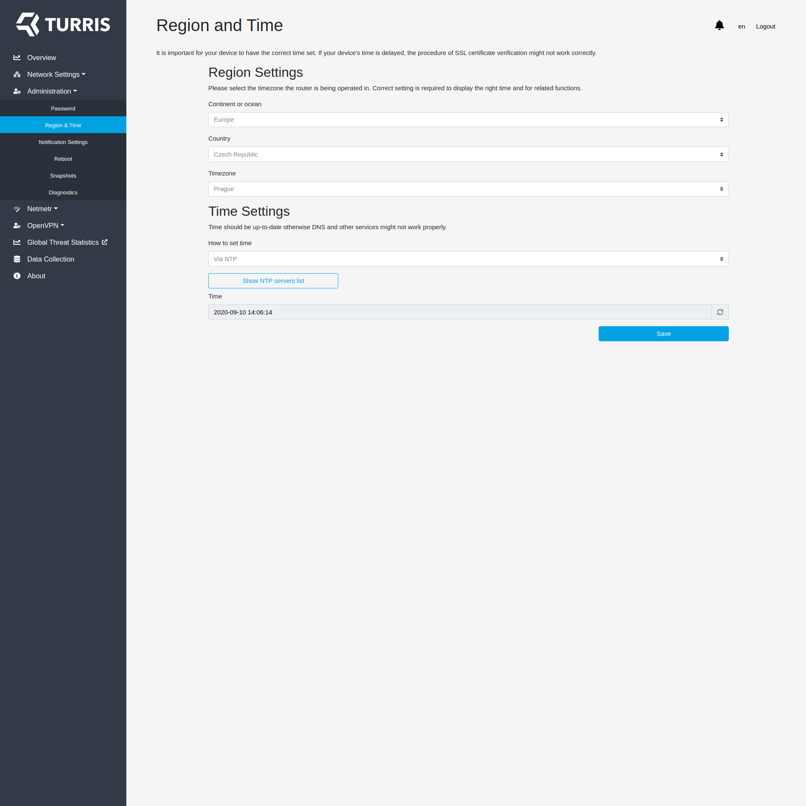
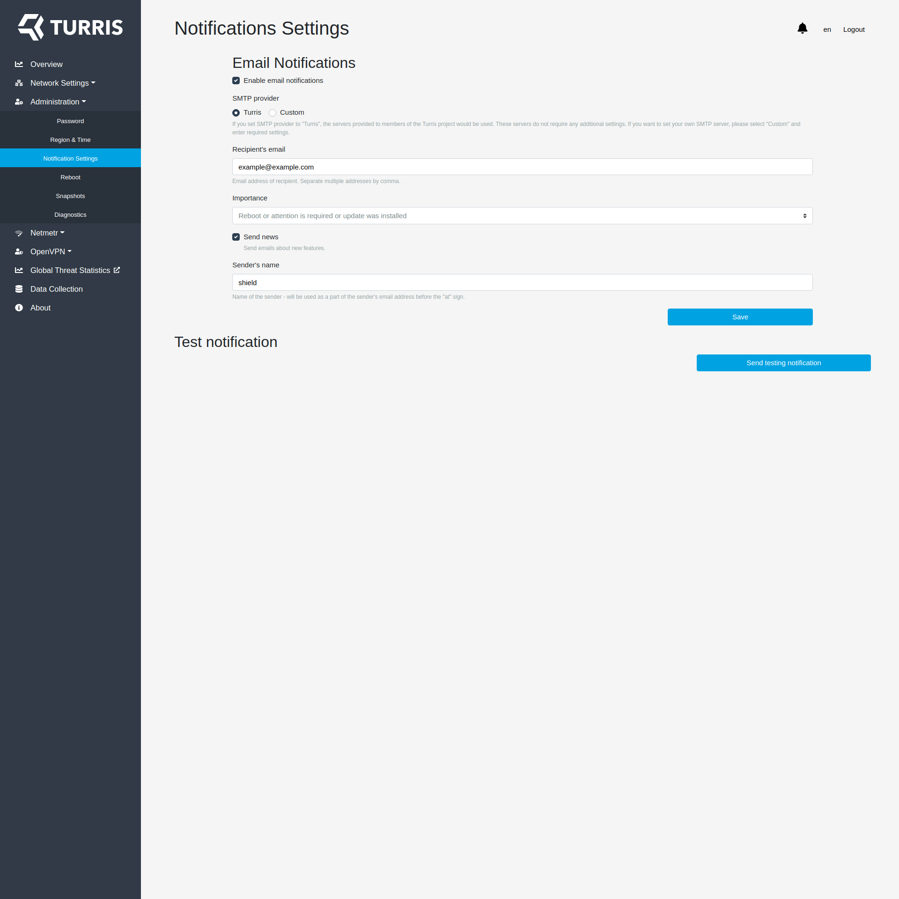
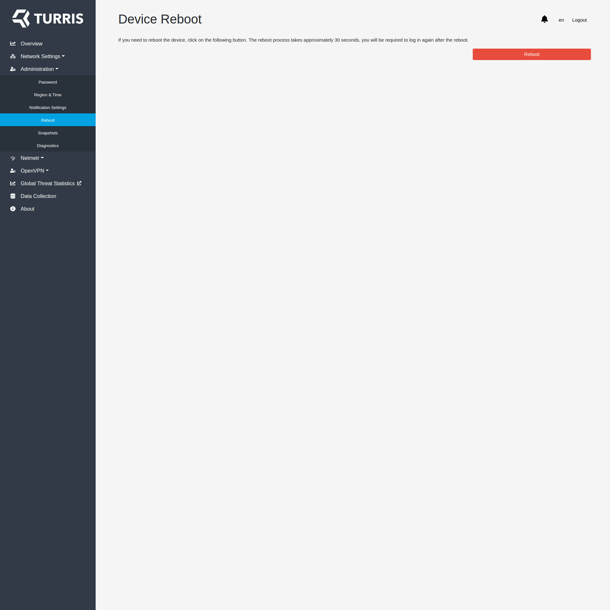
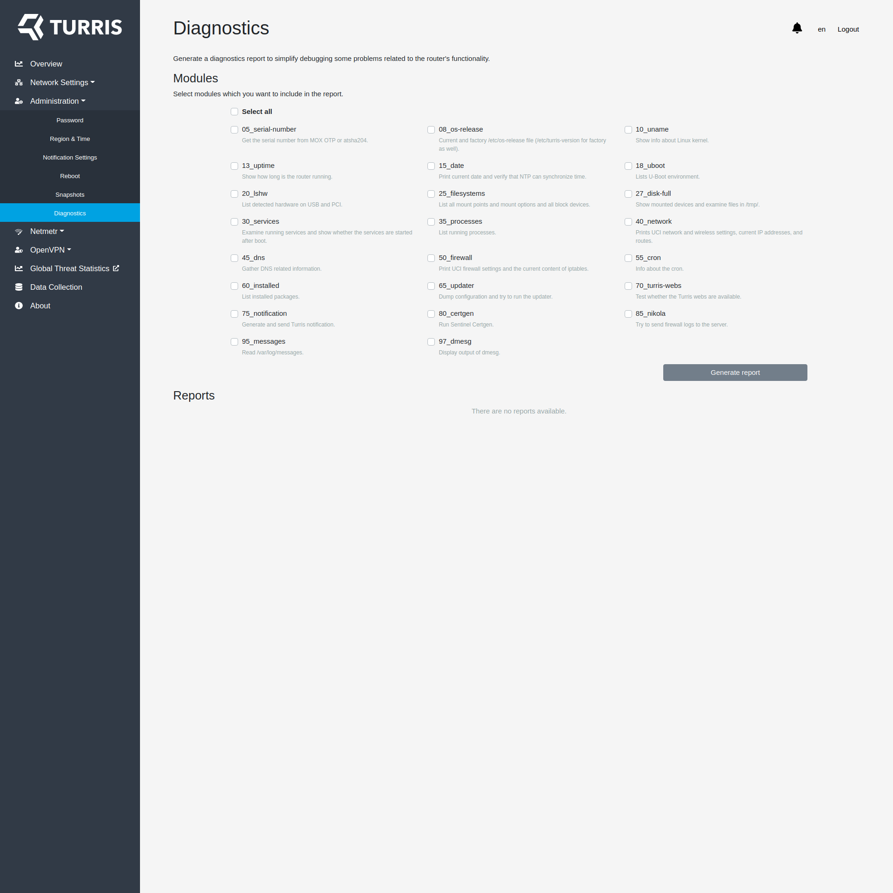
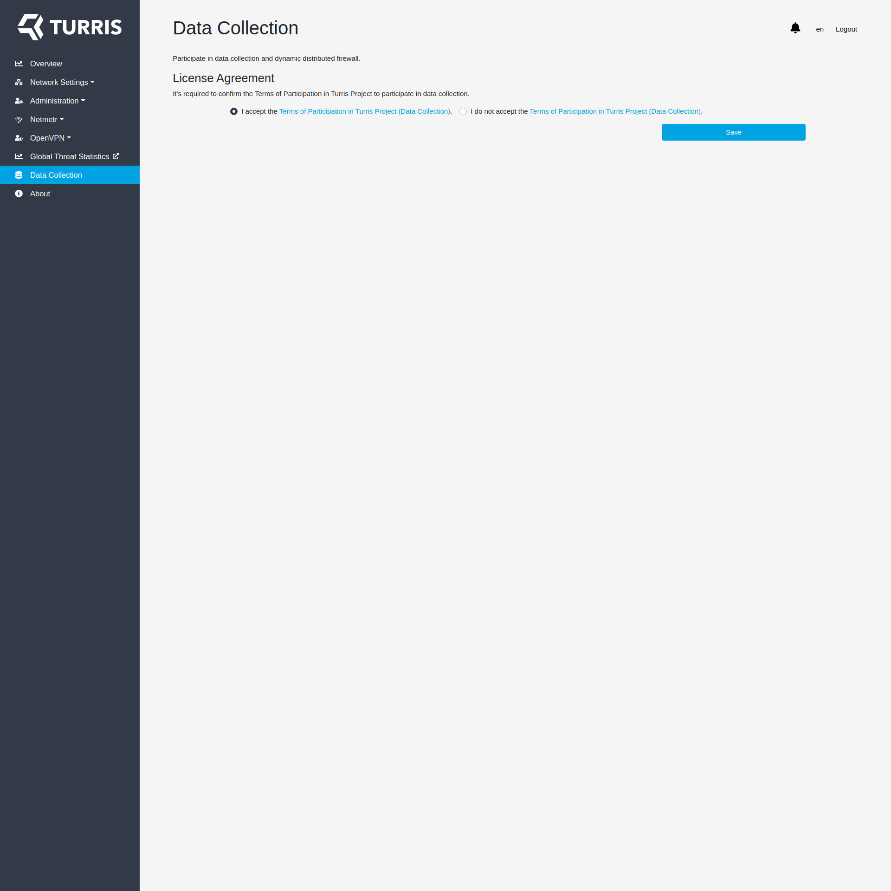
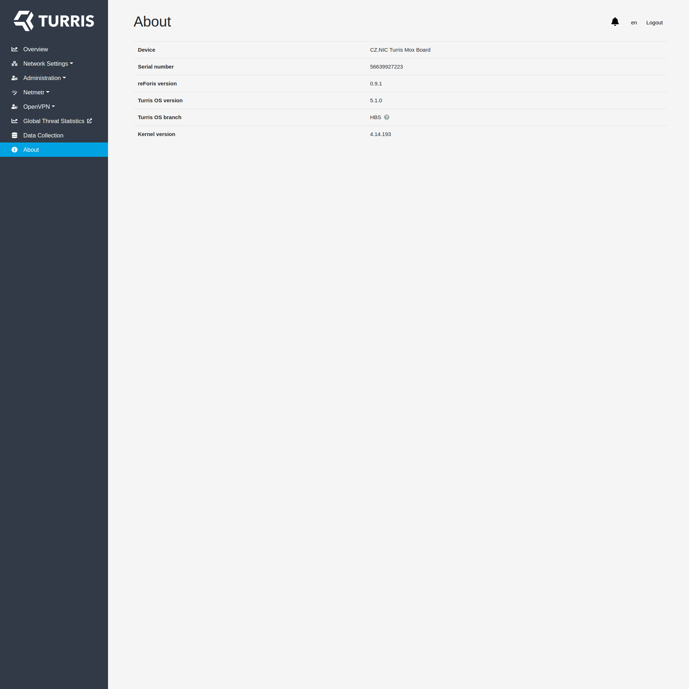

# Turris Shield screenshots

## Router overview

## WAN configuration

## LAN configuration

## DNS configuration

## Password management

## Region and time settings

## Notifications configuration

## Reboot button page

## Snapshots management

## Diagnostics generator

## Speed test results

## Speed test configuration

## VPN server configuration

## Management of clients for VPN server

## VPN client configuration

## Data collection settings

## About page

