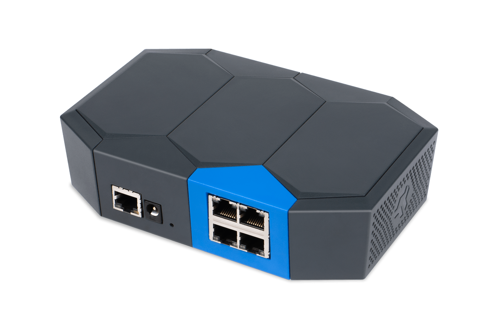

# Turris Shield

Turris Shield is a single-purpose device for everyone who wants to easily
secure their entire home or office without having to change their modem or
router.

Hardware-wise it is based on [Turris MOX](../mox/intro.md). The main
difference is software and target audience. While MOX is trying to be as
customizable as possible, Shield on the other hand tries to be as simple as
possible while still being secure.

## Software

Turris Shield comes with Turris OS with several important tweaks by default.
Setup guide is simplified to just entering your password which is immediately
offline (without ever leaving the router) checked against the list of passwords
collected from recorded attacks. From that moment onward, you are good to go
and can connect to the Internet.

Turris Shield is also the first device to feature reForis user interface by
default. It does not contain [LuCI](../../basics/luci/luci.md) nor Foris.
Automatic updates are enabled by default as is
[Turris Sentinel](../../basics/sentinel/intro.md) - key feature of
Turris Shield.

Other features readily available include support for DNSSEC, OpenVPN (both
[server](../../basics/apps/openvpn-server/openvpn.md) and
[client](../../basics/apps/openvpn-client/openvpn.md)) or for example automatic
notification of newly connected devices. Shield contains
the [NetMetr](../../basics/apps/netmetr.md) application too.

## Shield vs. MOX

Although Shield is based on MOX, there are some substantial differences
between them:

- **Shield cannot be extended by additional modules.** Eventually added modules
  cannot cause hardware damage but will not work due to missing software
  support. It is also not possible to replace the current C module
  (4x Ethernet) by any other module.
- **Shield uses some "magic" to determine the best address range on the LAN.**
  This is intended to avoid address collisions becase the given situation is
  more prone to them. Additionally, Shield always listens on 192.168.1.1.
- **Shield has modified rescue modes.** Because of simplified setup, the
  default is to reset to the factory state. See
  [Rescue modes](../mox/rescue-modes.md) for more information.
- **Only one setup type.** Shield supports only the router setup. It means
  that the WAN socket is connected to the uplink (with support for
  [PPPoE](https://en.wikipedia.org/wiki/Point-to-Point_Protocol_over_Ethernet))
  and the four LAN sockets are downlinks (with IPv4
  [NAT](https://en.wikipedia.org/wiki/Network_address_translation) and IPv6
  [DHCPv6 prefix delegation](https://en.wikipedia.org/wiki/Prefix_delegation)).
- **No support for guest networks.** There is no Wi-Fi adapter and
  the purpose of Shield is different than building complex networks.
- **No port forwarding nor custom firewall rules.** These features are out
  of the scope of Shield.
- **Automatic updates are always enabled and not configurable.** There is
  no reason to disable or delay automatic updates which are one of the key
  security features.
- **Additional software is not supported.** While MOX supports a wide range
  of installable software, Shield is intended to be as simple as possible
  and any additional software could lead to potential problems, e.g. with
  memory or CPU power.

We recommend to buy Shield if you want the simple device that just works out
of the box and is easy to setup. If you want more features, custom network
setup and additional opensource software, take a look at MOX or Omnia.

## Available documents

 * [Declaration of Conformity](Shield-DoC.pdf)
 * [Official datasheet](shield-datasheet.pdf)
 * [Official printed manual](shield-manual.pdf)

Schematics for modules that Turris Shield consists of are available:

 * [MOX A](../mox/Turris-Mox-A.pdf)
 * [MOX C](../mox/Turris-Mox-C.pdf)
