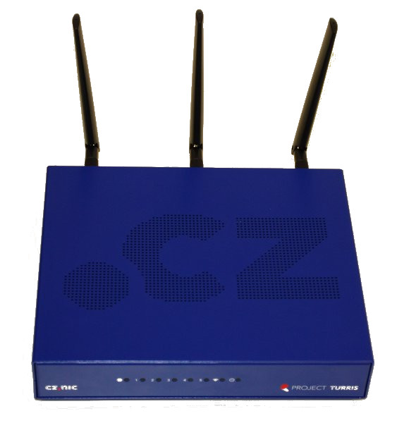
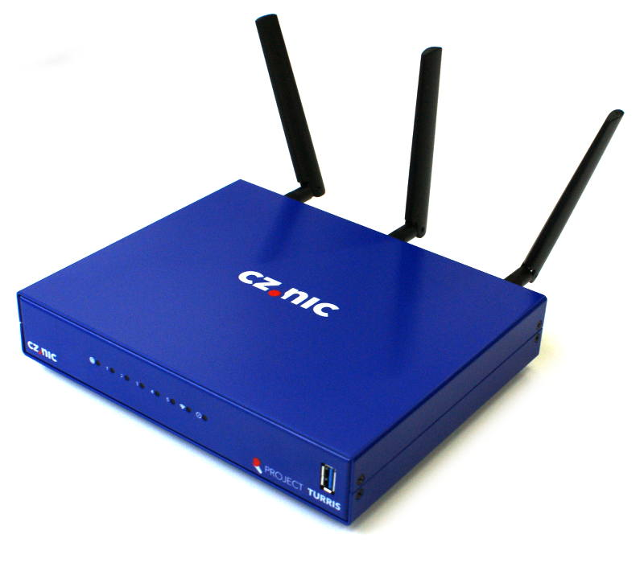
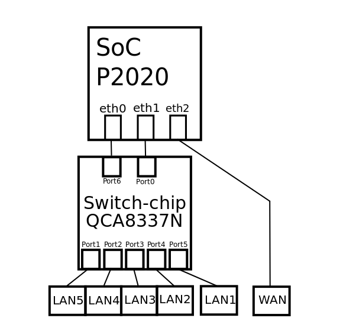

# Turris 1.0/1.1

Turris 1.X is a powerful router that was part of Turris security research
programme. It was based on **Freescale P2020 CPU**. It was dual core PPC CPU
running at **1.2 GHz**. It was shipped wit **two gigs of RAM** in SO-DIMM slot.
As a storage it used **256 MB NAND** memory.

## Difference between 1.0 and 1.1

There are few small differences between version 1.0 and 1.1. The most obvious
one is that case is a little different. But there are functional differences as
well. 1.0 used 7.5 V power supply while 1.1 used 12 V. Also 1.1 had on top of
1.0 USB 3 port directly accessible and contained SIM slot, so you could use LTE
modem inside.

### Turris 1.0

### Turris 1.1

## Network interfaces

Both Turris 1.0 and 1.1 has three physical Ethernet ports. One of them (_eth2_)
is dedicated as WAN and connected directly to WAN port. The remaining two ports
are connected to a fully manageable switch as shown on the picture bellow.

## Various documentation files

* [Printed manual (Czech)](turris-uzivatelska-prirucka.pdf)
* [Description of connectors and DIP switches for Turris 1.0](turris10-pinout.pdf)
* [Block diagram for Turris 1.0](turris10-block-diagram.png)
* [Complete HW documentation for Turris 1.0](CZ-NIC-Router-TURRIS-version-1.zip)
* [Complete HW documentation for Turris 1.1](CZ-NIC-Router-TURRIS-version-1-1.zip)
* [STM32F0 Power Control firmware](https://gitlab.nic.cz/turris/hw/turris_power_control)
* [Lattice CPLD firmware](https://gitlab.nic.cz/turris/hw/turris_cpld)
* [Description of CPLD registers](turris-CPLD-registers.pdf)
