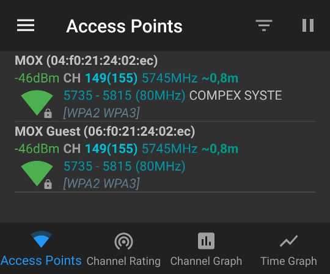

# Wi-Fi coverage and router placement

If you use your Turris as a Wi-Fi access point you can read something about
signal coverage and optimum router placement.

## About Wi-Fi

[Wi-Fi](https://en.wikipedia.org/wiki/Wi-Fi) (originally _Wireless Fidelity_)
is a popular technology used for wireless networking. It can be used for
accessing the Internet as well as for communication between devices in the
same local network (computers, mobile phones, tablets, smart TV sets, smart
home appliances...).

Wi-Fi is based on electromagnetic waves. These waves spread from their source
(ie. a communicating device) to the space. Their intensity drops with
distance (with its square; thus double distance means four times lower
intensity) and are absorbed in matter.

For Wi-Fi communication, sufficient level of signal (ie. intensity of
electromagnetic waves) has to be available. Lower levels cause lower
transmission speed, lower reliability (transmitted packets are more likely
damaged and must be retransmitted) and more frequent outages.

Transmission power of Wi-Fi is limited by regulatory rules. It is both due
to health concerns and prevence of interference between different networks
and other devices (because the same frequency range is used also for other
purposes like Bluetooth, microwave ovens or some medical equipments).

It means that suitable placement of each Wi-Fi device is very important.
And if your Turris acts as a Wi-Fi access point it applies even more for it.

## Absorption in materials

Different materials have different absorption rate. You should keep this in
mind when you search for the optimum place for your router or another Wi-Fi
device.

### Some materials with heavy absorption

* reinforced concrete (steel concrete); e.g. in carrying walls or floors
* steel lathing; e.g. on mortared wooden walls
* metal plates or metallized sheet covering; e.g. on roofs
* metallic lattices or shutters; e.g. at windows
* thick layer of stonework; e.g. in walls
* anti-sun glass or anti-sun foil; e.g. in windows
* soil; e.g. around cellars
* electronic devices; e.g. TV sets or audio systems

### Some materials with medium absorption

Various materials used in walls, floors, ceilings etc., for example:

* plain or areated concrete
* brick
* thick layer of wood
* thin layer of stonework

### Some materials with light absorption

* glass; e.g. in windows
* plasterboard/drywall; e.g. in thin walls
* thin layer of wood; e.g. in doors or furniture
* asphalt sheet covering; e.g. on roofs
* plastics; e.g. in furniture
* fabrics (both natural and artificial); e.g. in curtains
* papier-mâché or paper composites; e.g. in thin walls, doors or furniture

The above list is only illustrative. There are many and many materials and their
absorption rate may differ according to their composition. Porous materials
like bricks or wood can sponge up water and their absorption rate will rise.

## Interference between devices

All Wi-Fi and other devices which emit radio signal can mutually interfere.
It applies especially on devices working on identical or near frequencies.
This interference can lead to lower trasmission speed, outages or other
problems.

!!! info
    Examples of such devices are GSM BTS, Bluetooth dongles, home
    automation devices, traffic speed radars, weather radars, uncovered
    desktop PCs, microwave medical equipments and many others.

Your router should be as far as possible from such devices and/or to a place
where such signal sources are somewhat shielded e.g. by a wall. Another
approach is to try different frequency channels.

<!--wheather-radars-start-->
!!! notice
    All authorized Wi-Fi devices must detect weather radars and change their
    channels to not interfere with them. Don't be suprised if your
    router would do so. It applies only for the 5GHz range.
<!--wheather-radars-end-->

## Where to place your router

There are several criterions which should be considered:

1. As lower distance to the farest point (where you want to use some Wi-Fi
   device) as possible. It usually means that the router should be
   placed near the center of your flat and on the middle level of your house.

2. As little of heavy (and medium) absorbating materials as possible. It's
   often not easy but even so useful. For example, find a position where
   the signal can pass through wooden doors instead of thick stonework walls.

3. As far as possible from other devices emitting radio signals.
   See above for details.

4. Availability of the uplink. It depends whether you can/may modify
   the building (if it is necessary) or accept the uplink cable in bulk.

5. Avalability of electricity. It is similar to point no. 4. But if you have got
   a MOX there is possibility to add [a PoE add-on](mox/addons.md)
   and supply it over the uplink cable.

6. Omnia and MOX [mPCIe Wi-Fi](mox/addons.md) can cover much larger area
   than MOX SDIO Wi-Fi. If you have only the SDIO consider to buy the
   mPCIe add-on.

7. Your router should be avoided too high or too low temperatures (below
   0 °C or 40 °F and over 40 °C or 104 °F) as well as direct sun. Because
   it produces some heat itself so fresh air should have free access to it.

!!! tip
    One access point isn't usually sufficient to cover more than one level
    (especially in buildings with floors made of reinforced concrete).
    We strongly encourage to use multiple access points. We have designed
    a special solution for this. It consists of one Omnia (which is the main
    access point) and one or more MOXes (which act as subordinated points).

## How to measure signal

If you try to find the best place for your router you can utilize measurement
of the Wi-Fi signal. There are many tools but probably the most suitable
for many situations is
[WiFi Analyzer](https://vremsoftwaredevelopment.github.io/WiFiAnalyzer/).

WiFi Analyzer is a simple mobile application for Android which measures
and visualizes signal levels and displays other useful Wi-Fi data. It can
be installed from:

* [F-Droid](https://f-droid.org/en/packages/com.vrem.wifianalyzer/)
* [Google Play](https://play.google.com/store/apps/details?id=com.vrem.wifianalyzer)

The application is distributed under the GNU GPLv3.

!!! notice
    This WiFi Analyzer should not be confused with another program with
    very similar name which could be also used but it is proprietary
    and has two distinct editions (one free-as-in-beer and one paid).

You can install the application and move your mobile device to the places
where you want to use Wi-Fi the most often. The measured values could be
interpreted as follows:

* -50 [dBm](https://en.wikipedia.org/wiki/DBm) or more: excellent level
* -60 up to -50 dBm: good level, suitable for the most of work
* -70 up to -60 dBm: moderate level, suitable for regular work
* -80 up to -70 dBm: low level, sufficient only for unpretending use
* less than -80 dBm: mostly unusable

Keep in mind that different devices would have various levels of the signal,
according to their antennas and Wi-Fi interfaces. Thus if one device works
it needn't mean that another device will work too.

!!! info
    If you use both Wi-Fi ranges (2.4 GHz and 5 GHz) you can encounter that
    they behave differently. The 5 GHz range can reach shorter distances but
    is usually less interfered by networks in the neighborhood or other
    sources (and thus it's more reliable). On the other hand, older devices
    don't support it.
