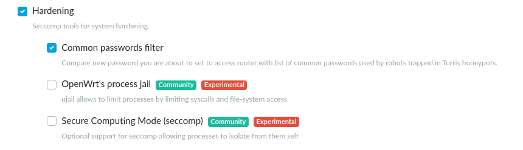
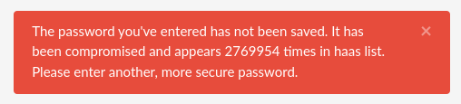

# Common passwords filter

Common passwords filter is a new **reForis** feature which improves router security by
comparing user passwords with a database of compromised passwords.
The database is placed on the router and the passwords are compared locally.

## Filter activation
_Common passwords filter_ can be activated in _Package Management -> Packages_.
To activate it check the _Common passwords filter_ checkbox and confirm it by pressing _Save_.

## Filter usage
To use the filter go to _Administration -> Password_ and
set the new password.

In case that your password was compromised, reForis will not allow you to use it.
This is also indicated by an error message.

If the password isn't present in the database it will be set as the new one.

!!! info
    The password database is created with help of the Turris Honeypot. It contains
    passwords which were used by attackers. Because of that it is no longer
    safe to use them in the router.
