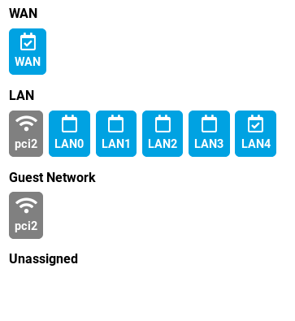

# Solving common problems

## Can't connect to my router

If you do some advanced configuration it is easy to make a mistake and cut
yourself out of your router. Some changes also take effect on service restart
or reboot so you might face an issue even sometime after you finished
experimenting with your settings. To be safe, we recommend to do a snapshot
before you start experimenting. We have a tool called
[Schnapps](../geek/schnapps/schnapps.md) to help you with that and where you
will find an examples how to use it to create a snapshot.

To be able get back to your router, the easiest way to do so is to use
rescue mode (on [Turris Omnia](../hw/omnia/rescue_modes.md) or
[MOX](../hw/mox/rescue_modes.md) to get to the earlier snapshot or to do a
factory reset. In both cases your current state is saved as another snapshot so
you can still mount it and explore the changes you made later.

Other possible option is to use a [serial console](../hw/serial.md) to debug
stuff directly on the router but this is only recommended for really advanced
users.

## Internet doesn't work

If you can no longer connect to your favorite sites, there could be various
reasons why it doesn't work. Here are few most common ones.

### Random packet drops

Sometimes websites doesn't load just to load flawlessly after next refresh.
There can be variety of reasons. The most important part is to figure out
whether the issue occurs before or after the router.

#### Wi-Fi

Try first to figure out whether it happens while connected over cable as well.
Reason behind that is that sometimes Wi-Fi signal can be low or there might be
interference with other devices using the same frequency. Possible fix for that
is to try using different channel in Wi-Fi settings or move your router
physically to be closer to the center of the area you want to cover/further
away from the source of interference.

If your client device supports both 2.4 GHz and 5 GHz band, you might also want
to try different band. 5 GHz one is usually much less polluted.

#### Faulty cable

The easiest thing to try that can affect both LAN and WAN side. Try using different
cable. Sometimes cables bend and get damaged. This damage doesn't need to be
visible and simple cable testers wouldn't discover it either, so replacing the
cable is the safest test.

### DNS doesn't work

Our routers comes with [Knot Resolver](https://www.knot-resolver.cz) which is
validating and caching DNS resolver. Some ISPs break DNSSEC and therefor some
DNS queries will fail.  If you experience troubles resolving domain names, try
various settings in [DNS tab in Foris](foris/dns/foris-dns.md). Most notably
you can disable forwarding and rely on your router resolving everything itself,
or you can forward to some DNS resolver with **DNS over TLS** like CZ.NIC, Cloudflare, Google.
operated by CZ.NIC.

### Nothing works

There could be again multiple culprits.

#### Disconnected/completely broken cable

Surprisingly quite common error. Cable can get disconnected by accident without
anybody noticing if somebody trips over it when moving furniture or for
example by a pet.

You can check whether your router has a network link (is connected to some
powered up device) in section _Network Interfaces_ in Foris. The ones with a
checkmark are connected to some powered up devices. This does **not** mean
that cable is alright, but that at least it is somehow connected and working.

#### ISP has some issues

Sometimes even your ISP faces some outage. Sometimes they announce it on their
website, sometime the only way to check is to try to connect directly without
using the router if possible or ask your ISP.

#### Misconfigured firewall/DHCP

If you played with settings in [LuCI](luci/luci.md), you might have set some
options that would break your firewall or DHCP settings. There could be ton of
settings that could influence it.

The easiest way to fix it is to either revert to some previous and still working
snapshot by using [Schnapps](../geek/schnapps/schnapps.md) or to do a complete
Factory reset using rescue mode on both Turris
[Omnia](../hw/omnia/rescue_modes.md) and Turris
[MOX](../hw/mox/rescue_modes.md).

#### Misconfigured WAN

Double check your WAN settings in [Foris](foris/wan/foris_wan.md) to make sure
it corresponds the recommended settings from your ISP and do WAN test from
within the Foris.

## Additional accessory doesn't work

If your Turris Omnia can't setup your Wi-Fi card or if one of your MOX modules doesn't
work, try to reproduce the issue first on the latest release. Ideally by
flashing your router with the latest medkit (and setting just bare minimum from
the scratch) to avoid any misconfiguration.

You can do so by using rescue mode on both Turris
[Omnia](../hw/omnia/rescue_modes.md) and Turris
[MOX](../hw/mox/rescue_modes.md).

If it doesn't help, contact our [support](support.md) and provide us with
diagnostics, which can provide us leads, where the issue might be. This is only
concerning Turris provided hardware, we do not support every random USB gadget
known to mankind.

If you have hard time getting some third-party hardware working, make sure you have
installed correct kernel module and firmware and that your device is supported
by the kernel available in our releases. If all of that is true, you can try to
ask for help with debugging it on our [forum](https://forum.turris.cz).

## Turris MOX not booting over the network

Make sure that your Turris MOX does not contain any media to boot from. Also
make sure that your other router has _MOX netboot_ package list enabled in
_Updater_ tab in Foris. Last but not least, booting over the network works
only via the Ethernet connector on MOX A and after the first boot, only with
the router it is paired with. Pairing is lost on factory reset of controlling
router. To make sure your MOX is not paired with already, use [Factory
reset](../hw/mox/rescue_modes.md#rollback-to-factory-reset).
