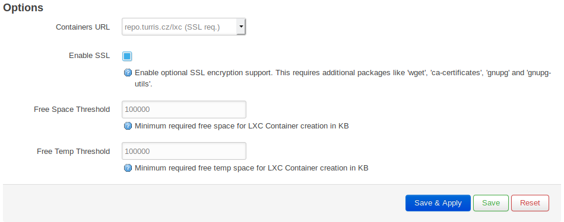
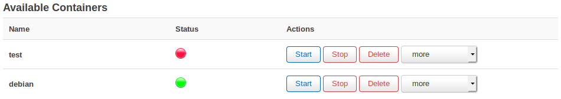

# LXC on Turris


## What is LXC?

The Linux Containers ([LXC](https://en.wikipedia.org/wiki/LXC)) is an
[OS-level virtualization](https://en.wikipedia.org/wiki/OS-level_virtualisation) method for running multiple containers
with a single Linux kernel. Each LXC container is isolated from the host environment and from the other containers.
LXC allows to limit and prioritize system resources on the fly. You can run various Linux distributions on your Turris (e.g. Debian, Ubuntu or openSUSE).

Because it is only a containerized environment and not a true virtualization it offers very low overhead. On the
other hand, only one kernel can run for all containers and this limits the scale of usable operating systems
(only Linux distributions can be used and they must support the given kernel).

## Before you start using LXC

Remember that standard Linux distributions are write-intensive and it is strongly discouraged to operate them on
the internal [eMMC](https://en.wikipedia.org/wiki/MultiMediaCard#eMMC) flash storage. Please set up and use an
external storage such as an USB HDD or SSD. Read the [Storage plugin](../../basics/foris/storage-plugin/storage-plugin.md) page for more information how to do it.

!!! danger
        Operating LXC on the internal flash storage may lead to rapid degradation and eventually to failure of the storage.
        This may void your warranty. 

## LXC packages

Although LXC can't be currently managed using Foris its packages can be installed in it. Go to the _Updater_ page,
check the _LXC utilities_ and press the _Save and update_ button. It will install the packages and you will
be able to see the information about it at the _Notifications_ page.


## LXC management in LuCI

LXC containers can be created, deleted, started, stopped etc. through the LuCI - advanced administration web interface. Choose _LuCI OpenWRT
advanced web configuration_ at the homepage of your Turris and log into it. Then go to _Services -> LXC Containers_.

*You will be warned that you will need a custom OpenWrt image. This warning may be ignored because Turris OS is
such custom image and supports LXC.*

### Options

There are four parameters you can change to fit the LXC environment to your requirements:

* _Containers URL_ - The default is `repo.turris.cz/lxc` which is provided by the Turris team. This server provides
a set of selected Linux distributions including Turris OS. These distributions are tested and should work properly.
You can set `image.linuxcontainers.org` as well (which provides a larger set of distros) or write in your specific
LXC image repository.
* _Enable SSL_ - Check this to enable SSL support. If you use `repo.turris.cz` as your repository this must be checked.
* _Free Space Threshold_ - The minimum free disk space (in KB) for LXC container creation. If the free space falls
under this value no new container may be created. The default value (100 MB) is usually suitable. 
* _Free Temp Threshold_ - The minimum free temporary disk space (in KB) for LXC container creation. If the temporary
free space falls under this value no new container may be created. The default value (100 MB) is usually suitable.



After done, press _Save & Apply_ or _Save_ to save your values. If you choose the first of the buttons it will
be applied immediately (and a new set of Linux distros will be downloaded).

### Create New Container

There are only two things to do before creating a LXC container. Write its name into the _Name_ field and choose
the Linux distribution to install (from the _Template_ drop-down list). Then press the _Create_ button and
the process of the creation  of a new LXC container will start. This can take a while. In LuCI you cannot see the progress and if it
fails, you might not find why.


All new containers are by default configured to have a one virtual network card, which is connected to the LAN bridge
of your router. Network wise the container behaves like any other computer on the local network. You can assign
a static IP address to the container or set a DHCP server to it. Setting up a port forwarding or even create some rules for the container in your firewall are also possible.

### Available Containers

All the containers you have created are displayed in this section. You can do these operations (three of them
have buttons and the others are available in the drop-down list):

* _Start_ - It starts the container (it it similar to turning-on a physical machine) if it is stopped. It will boot
and be ready to use in a moment.
* _Stop_ - It executes a clean shutdown of the container. If the container fails to cleanly exit in 60 seconds, it will
be forced to stop.
* _Delete_ - It deletes the container. All the data stored inside will be lost. Running containers can't be deleted
(stop the container first if you want to delete it).
* _Reboot_ - It executes a clean reboot of the container (it is similar to the well-known Ctrl+Alt+Del keyboard
combination).
* _Freeze_ - It freezes (suspends) all processes in the container until they will be unfreezed (thawed).
* _Unfreeze_ - It unfreezes (thaws) previously freezed processes in the container.
* _Configure_ - It opens a text area where you can edit the container parameters. *Don't change anything unless you
know what you want to do! Wrong values may lead to container malfunction.*



The _Status_ column contains green bullets for running containers and red bullets for not running containers.

## LXC management in CLI

The command line interface (CLI) provides much large set of the LXC tools. Here are a few examples:

```
lxc-ls -f
```

This commands displays all created containers, including their names, states and IP addresses. If you omit the `-f`
argument only a plain list of container names will be displayed.

```
lxc-create -n test -t download
```

It downloads a list of templates first and displays it. You will be asked to choose the distribution (e.g. `ubuntu`),
release (e.g. `xenial`), and architecture (`armhf`). Then it will download the chosen distro image and install it.
The new container will be named "test".

!!! tip
        A common mistake is a typo in architecture. It is `armv7l` (arm seven el) instead of `armv71` (arm seventy-one).

```
lxc-start -n test
lxc-stop -n test
```

The first command starts the container named "test" and the second one stops it gracefully (see above for details).

```
lxc-destroy -n test
```

This command destroys the cointainer. It must be stopped before destroying.


## Connecting to your LXC container

For your first connection to a new container has to be used a SSH connection to your Turris. Run a SSH client and
connect to it. For example, if your router has the IPv4 address 192.168.1.1. Then you can use something like this:

```
ssh root@192.168.1.1
```

Use the same password as you use to log in LuCI. Now you can check whether your container is ready:

```
lxc-ls -f
```

If you can see its name with the `RUNNING` state you can attach the container now:

```
lxc-attach -n test
```

Now you are inside the container and you can work as usually (according to the distro you have installed). To allow
direct access to the container, consider to install the SSH client package(s) and set the root password. Even better is 
a usage of SSH public key(s) for the authentification. After this procedure, you will be able to connect directly. The IP addresses
of the container can be obtained from the `lxc-ls` listing (see above) or by running `ip addr` inside the container
(if your distro supports it).

## Starting the container at boot

To enable automatic startup of your container at boot, you need to edit the configuration file: `/etc/config/lxc-auto`.

Here is an example configuration file:

```
/etc/config/lxc-auto

    config container
            option name my_first_container
            option timeout 60
     
    config container
            option name my_second_container
            option timeout 120
```

As you can see, you can configure multiple container sections. Every container here will start at boot and each
of them will be correctly halted during the shutdown. Set the `timeout` option to specify how much time in seconds
the containers have to gracefully shut down before being killed. The default value is 300.

## FAQ

###Alpine Linux


**[Alpine Linux](https://en.wikipedia.org/wiki/Alpine_Linux) used to have a configured network and was working
immediately after the installation. Why isn't it working now?**

In the beginning of February 2018, the people at [LinuxContainers.org](https://linuxcontainers.org/) decided to remove
architecture armhf for Alpine. Community asked us if we can bring it back. Right now we use an image from their
official website [AlpineLinux.org](https://alpinelinux.org/downloads/), but it is mini root file system, which is
primaly made for Docker or chroots, which is why you need to setup the network and also a few other things. To find
out how to set it up, have a look in our community documentation.

In the meantime we created [issue in LinuxContainers.org's Github](https://github.com/lxc/lxc/issues/2161)
and they should bring back Alpine, but only for LXC 2.0. This version will be included in Turris OS 4.0.

###Docker

**Is it possible to have Docker on Turris Omnia?**

[Docker](https://en.wikipedia.org/wiki/Docker_(software)) isn't officially supported. However, if you know what are
you doing and you really need to have Docker on the Turris Omnia, you can follow these instructions, which you can find on
[our forum](https://forum.turris.cz/t/docker-on-turris-omnia/242/37).
